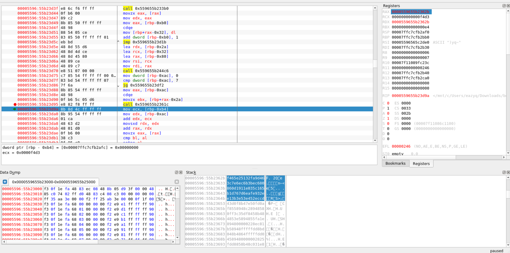

# [ASIS CTF Quals 2021](https://asisctf.com/): [beanstalk]

**Category:** RE

**Description:**

> You need to enter the license key before validating the flag. It's not easy!


### First look

 

The binary ask for a License Key and then check it's format


### Get the key format

In function main we can see the string "License Key: " and right after that at `0x00102b40` it call `std::cout` to print the string


At `0x00102b56` `std::cin` is called to take the input (key) from user 


RDX now has a pointer to the address of input 

After the call to `std::basic_string` to make key become 
`basic_string` type, the input now passed into 
`license_to_key` function through RSI register


At `0x001026a0` `std::basic_string::size` is called and then being compared with 0x1b

At `0x001026c1` it find the string "BEAN-" in key and check the return number if it equal 0 or not

So now we know the license key must be 27 in size and started with "BEAN-"


From `0x001026e5` to `0x001026fe` it passes 0x9 and key to 
`std::basic_string::operator[]` which return the char at index 0x9 from key to RAX

The char then being compared with 0x2d which is "-" in ascii table

The same thing happen from `0x00102700` to `0x00102717` but now index 0x14 is being checked

The license key is sth like this
`BEAN-xxxx-xxxxxxxxxx-xxxxxx`


3 `std::basic_string::substr` function is called to seperate the key into 3 smaller strings (the "xx..." above)

Then the 3 new strings is checked if they contain any char that not in "0123456789abcdefABCDEF"


Now if we test `BEAN-aaaa-aaaaaaaaaa-aaaaaa`

 

 

The format was right

The remaining part of `license_to_key` function is just storing 3 small string to `param_2` in reverse order like this

ex: BEAN-1234-abcdefghjk-567890
->  43.21.kj.hg.fe.dc.ba.09.87.65


### Get the key
 

Now the address of re-ordered sequence of hex is passed to 
`Beanstalk` function as second parameter through RSI

Analysing through the binary i relized that `Beanstalk` function will use the hex from second parameter to generate a key2 which is 10 in size

I use decompiler to see the whole algorithm

 


First it allocate 0x50 = 80 bytes and return pointer to first 8 bytes to `pvVar1`

Line 16 allocate 0x100 = 160 bytes and return pointer to the first 8 bytes which was allocated earlier

The first loop loop 10 times so this is what we have


At line 19 function `t()` generates a table and line 20 21 will use that table to fill the 160bytes which was allocated

Load binary to edb-debugger and place breakpoint at function t() then we will have table's address in RAX: [stack1](script/stack1)


From line 23 to 24 the bytes at index 0x77 will be placed into the key2

So if we know key2 we will find the license key we need

Back to `main` function


After `Beanstalk` key2 is passed to hash

The return value from `hash`, `k` and `k` are passed to 
`std::equal` so we know the two `k` will generate the true key2

By running the binary in edb-debugger we get these values


key2 is 10bytes so we have:

`key2 = 0xbf0b0fa2a5940ed7cb85`

Back to `Beanstalk` fuction we now can find the license key

```python
key2 = [0xbf,0x0b,0x0f,0xa2,0xa5,0x94,0x0e,0xd7,0xcb,0x85]
data = []
index = []

with open("stack1.txt") as file:
    for line in file:
        i = 32
        while (i > 17):
        	data.append(int(line[i : i + 2], 16))
        	i -= 2

for k in key2:
	indices = [i for i, x in enumerate(data) if x == k]
	index.append(hex(indices[0] ^ 0x77)[2:])

result = ''.join(index)
print(result)
```

Run the script above we will have `212a3448c81db976e624`

If we rearrange the output we will have license key: 
`BEAN-2a21-b91dc84834-24e676`


The key was right, but it seems that we still have another task to do

### Find the flag


First the program print "Flag: " and take input from user

Then it check the size of input with 0x2f = 47

So the flag must be lower than 48 in length

After that the program will try to encrypt the flag then compare with an unknown key so it is better to use decompiler now


We can see the string "[+] Correct!" and "[-] Invalid flag"

In the `while(true)` loop 8 chars of flag are taken then passed to `encrypt` function

If we plus 8 to local_88 we gonna have the address of 10 160bytes table so it gonna do sth with this table and those 8 chars

The second `for` loop check each bytes in the key, if it doesn't match then the program will print "[-] Invalid flag"

Then the `while` loop continue with the next 8 chars of flag

My ideal is the same as finding license key: try to reverse the `encrypt` function then find the true key to get the flag


First `for` loop breaks 8 chars of flag into 4 pairs of 2
`srand()` function generate seed for later use

Now we should capture the seed by set breakpoint in edb


The seed is passed to `srand()` through EAX = 0xf5f38a17

Then a bunch of `z` and `g + a number` functions are called and ended with a `for` loop which pass the result to `param_2`


In these `g + a number` function there are `g` functions with different parameters 

First let's analyze `g`


It's look like my dad's beard

I tried to convert those code to python

```python
def g (pos, var2, var3, var4, var5):
    flag[pos] = (table[(flag[pos] % 0x100) + 0x110 * var5] << 8) ^ flag[pos]
    flag[pos] = flag[pos] ^ table[(flag[pos] >> 8) + 0x110 * var4]
    flag[pos] = (table[(flag[pos] % 0x100) + 0x110 * var3] << 8) ^ flag[pos]
    flag[pos] = flag[pos] ^ table[(flag[pos] >> 8) + 0x110 * var2]

```

It should be easier to read now

Then i reverse it

I have no choice but to brute-force :sad:


```python
def b (pos, var2, var3, var4, var5):
    i = 0x0000
    while (i <= 0xffff):
        if (i ^ (table[(i >> 8) + 0x110 * var2]) == flag[pos]):
            flag[pos] = i
            break;
        else:
            i += 1
    i = 0x0000
    while (i <= 0xffff):
        if ((table[(i % 0x100) + 0x110 * var3] << 8) ^ i == flag[pos]):
            flag[pos] = i
            break;
        else:
            i += 1
    i = 0x0000
    while (i <= 0xffff):
        if (i ^ (table[(i >> 8) + 0x110 * var4]) == flag[pos]):
            flag[pos] = i
            break;
        else:
            i += 1
    i = 0x0000
    while (i <= 0xffff):
        if ((table[(i % 0x100) + 0x110 * var5] << 8) ^ i == flag[pos]):
            flag[pos] = i
            break;
        else:
            i += 1
```

Now is `z` function's part


Here we can see `rand()` is being used

I decided to create all random number the program gonna use
in c

```c
#include <stdio.h>
#include <stdlib.h>
int main(void)
{
    srand(0xf5f38a17);
    for(int i = 0; i < 32; i++)
        printf("%d, ", rand());
    return 0;
}
```

then i turned it into python's list

```python
rand = [444242706, 339433174, 1053149467, 1523027287, 1117968178,
        2092997650, 816324422, 1095556438, 747709558, 301071833,
        598496766, 1810696988, 953767466, 1765134604, 2028312134,
        1171168959, 1961149144, 425175821, 1299180724, 1105033260,
        282672453, 169003868, 412382634, 162192383, 492960224, 560096927, 
        1172437624, 128594585, 441632769, 1993060813, 966622640, 885875475]
```

here is the reversed python code

count is initialized as 31 because the program calls `z` 32 times

```python
count = 31
def a (var1, var2):
    global count
    iVar2 = rand[count] % 0x10000
    flag[var1] = (flag[var2] ^ iVar2) ^ flag[var1]
    count -= 1
```

Finally, we need to find the true key to feed our reversed code

Back to main, `f()` is called which return the true key

Again we set breakpoint in edb and get these [value](script/stack3.txt):



Now let's complete the final python script

```python
flag = [0x469d, 0xfa32, 0x51e2, 0x65f4]

rand = [444242706, 339433174, 1053149467, 1523027287, 1117968178,
        2092997650, 816324422, 1095556438, 747709558, 301071833,
        598496766, 1810696988, 953767466, 1765134604, 2028312134,
        1171168959, 1961149144, 425175821, 1299180724, 1105033260,
        282672453, 169003868, 412382634, 162192383, 492960224, 560096927, 
        1172437624, 128594585, 441632769, 1993060813, 966622640, 885875475]

table = []

with open("stack2.txt") as file2:
    for line in file2:
        i = 32
        while (i > 17):
            table.append(int(line[i : i + 2], 16))
            i -= 2


def a (var1, var2):
    global count
    iVar2 = rand[count] % 0x10000
    flag[var1] = (flag[var2] ^ iVar2) ^ flag[var1]
    count -= 1

def b (pos, var2, var3, var4, var5):
    i = 0x0000
    while (i <= 0xffff):
        if (i ^ (table[(i >> 8) + 0x110 * var2]) == flag[pos]):
            flag[pos] = i
            break;
        else:
            i += 1
    i = 0x0000
    while (i <= 0xffff):
        if ((table[(i % 0x100) + 0x110 * var3] << 8) ^ i == flag[pos]):
            flag[pos] = i
            break;
        else:
            i += 1
    i = 0x0000
    while (i <= 0xffff):
        if (i ^ (table[(i >> 8) + 0x110 * var4]) == flag[pos]):
            flag[pos] = i
            break;
        else:
            i += 1
    i = 0x0000
    while (i <= 0xffff):
        if ((table[(i % 0x100) + 0x110 * var5] << 8) ^ i == flag[pos]):
            flag[pos] = i
            break;
        else:
            i += 1


count = 31
b(0,4,5,6,7)
a(1,0)
b(1,0,1,2,3)
a(2,1)
b(2,6,7,8,9)
a(3,2)
b(3,2,3,4,5)
a(0,3)
b(0,8,9,0,1)
a(1,0)
b(1,4,5,6,7)
a(2,1)
b(2,0,1,2,3)
a(3,2)
b(3,6,7,8,9)
a(0,3)
a(3,0)
b(0,2,3,4,5)
a(0,1)
b(1,8,9,0,1)
a(1,2)
b(2,4,5,6,7)
a(2,3)
b(3,0,1,2,3)
a(3,0)
b(0,6,7,8,9)
a(0,1)
b(1,2,3,4,5)
a(1,2)
b(2,8,9,0,1)
a(2,3)
b(3,4,5,6,7)
b(0,0,1,2,3)
a(1,0)
b(1,6,7,8,9)
a(2,1)
b(2,2,3,4,5)
a(3,2)
b(3,8,9,0,1)
a(0,3)
b(0,4,5,6,7)
a(1,0)
b(1,0,1,2,3)
a(2,1)
b(2,6,7,8,9)
a(3,2)
b(3,2,3,4,5)
a(0,3)
a(3,0)
b(0,8,9,0,1)
a(0,1)
b(1,4,5,6,7)
a(1,2)
b(2,0,1,2,3)
a(2,3)
b(3,6,7,8,9)
a(3,0)
b(0,2,3,4,5)
a(0,1)
b(1,8,9,0,1)
a(1,2)
b(2,4,5,6,7)
a(2,3)
b(3,0,1,2,3)

result = []
for i in flag:
    result.append(chr(i >> 8))
    result.append(chr(i % 0x100))

print(''.join(result))

```

Here i feed the `flag[]` list first 4 pairs of 2 bytes and get `ASIS{DAT`

Seems legit

After feeding others 4 we will get the flag: `ASIS{DATA_1n_TEXT_1s_4n_34sy_0bfusc4t10n`

Let's test it


