# [Killer Queen CTF 2021](https://2021.killerqueenctf.org/): [gombalab]

**Category:** RE

### First look


Not stripped - nice!!!


### main.phase1()

This is a program written in Go so we need to get to `main.main` function

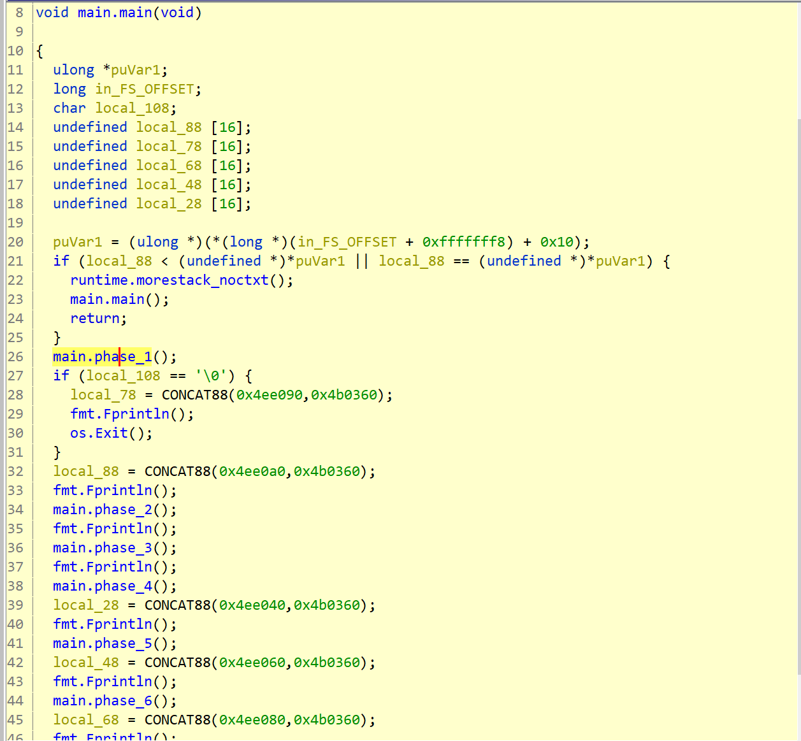

First it prepares the stack and then call `main.phase1()`

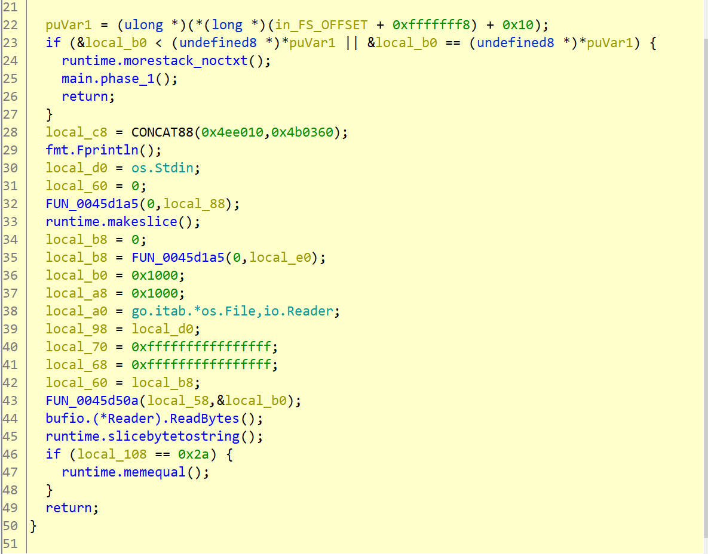

Here we can see `fmt.Fprintln()` function. It prints the first line we saw in the second pic. Then the program asks for input.

At line 47 there is `runtime.memequal()` which will compare the input with a string. That string can be found in dissasembler.


The input should be 0x2a = 42 in length. So the strings should be:

`For whom the bell tolls. Time marches on.`


## main.phase2()


More than 1 input maybe?

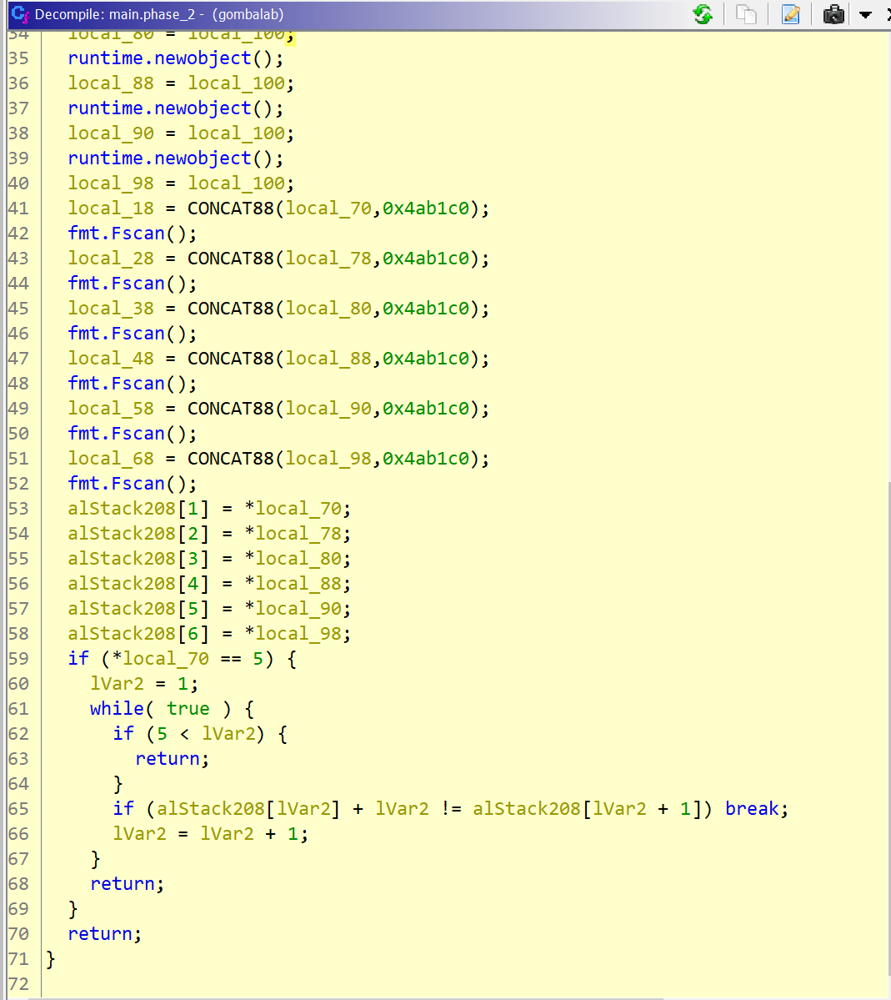

It does some preparations then call 6 `fmt.Fscan()` functions.

The first number should be `5`

Then below that there is a `while` loop to check inputs.

This is a python script to generates inputs:

```python
pos = 1
num1 = [0,5]
while pos <= 5:
	num1.append(num1[pos] + pos)
	pos += 1
num1.remove(0)
print(num1)
```

Result : `[5, 6, 8, 11, 15, 20]`

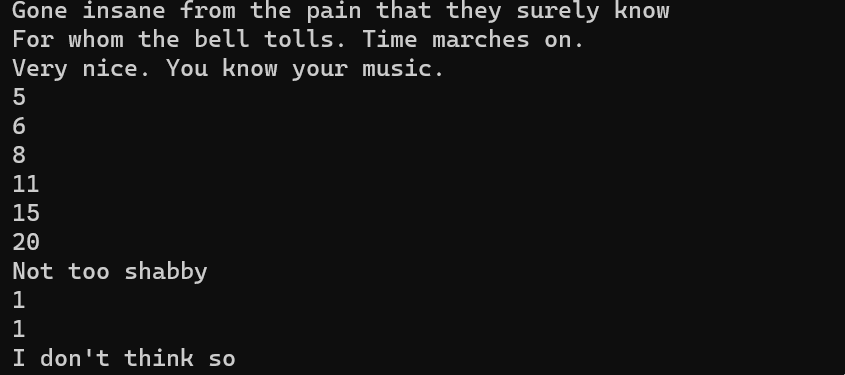

### main.phase3()

The program asks for 2 inputs

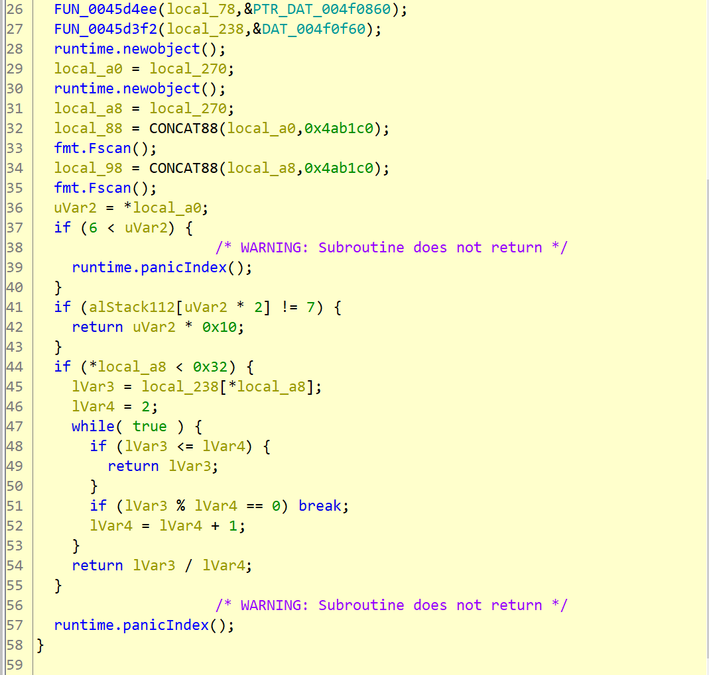

The first input should be lower than 7

It's hard to see what's happens next in decompiler so let's read the disassembler

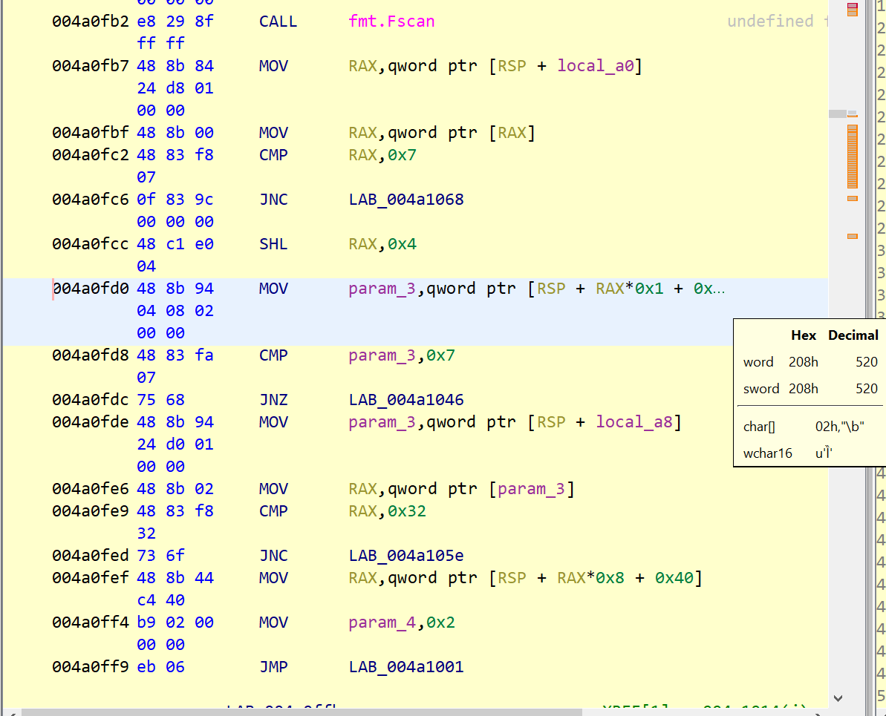

`RAX` contains first input then shift left 0x4 (multiplied by 2 ^ 4) 

Here we need to find where `RSP + 0x208` is.


So `RSP + 0x200` is `[PTR_DAT_004f0860]`

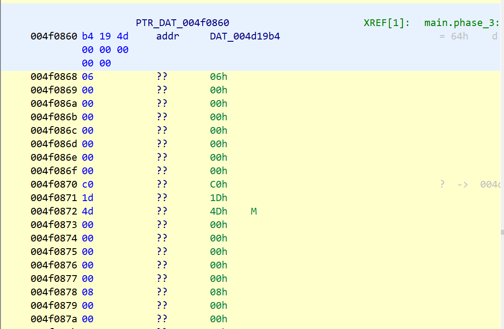

`004f0868` must be `RSP + 0x208`

Scroll down and then we can find the `0x7` byte at `004f0898`

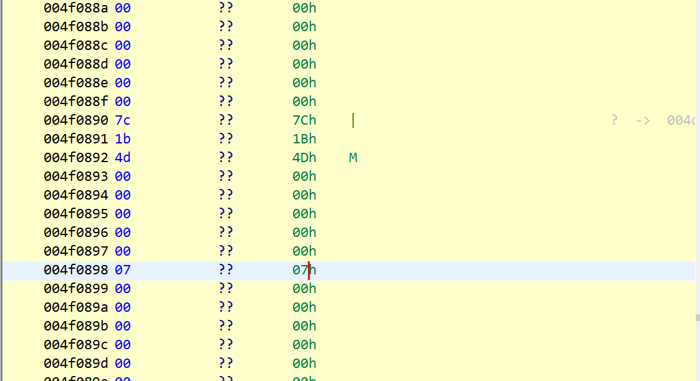

`(0x004f0898 - 0x004f0868) >> 0x4 = 3`

So `3` is the first input


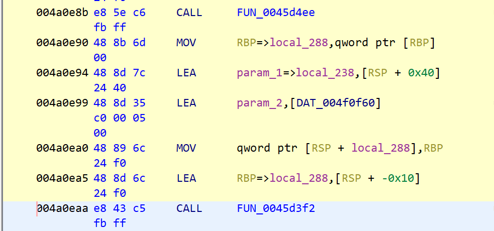

The second input is an index of a prime number in `[RSP + 0x40]`

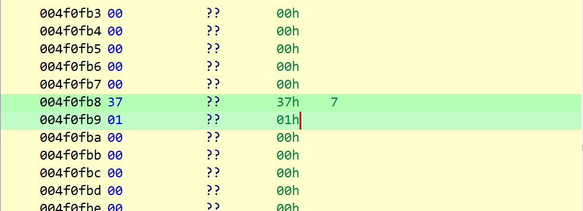

`0x137` is a prime number

`(0x004f0fb8 - 0x004f0f60) / 8 = 0xb`

So `0xb` or `11` is the second input

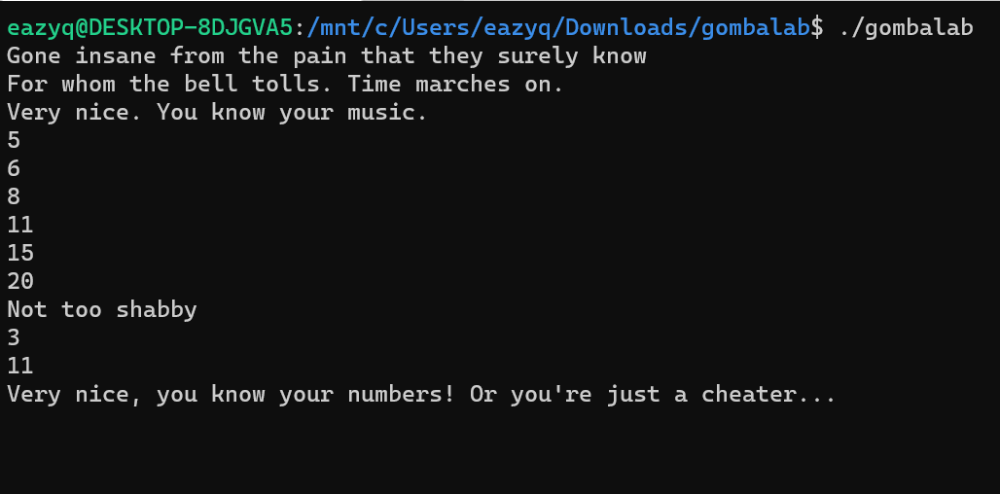

### main.phase4()

Phase 4 asks for a number and pass input to `main.func4`. After that it checks the result with `0x2ff42`.

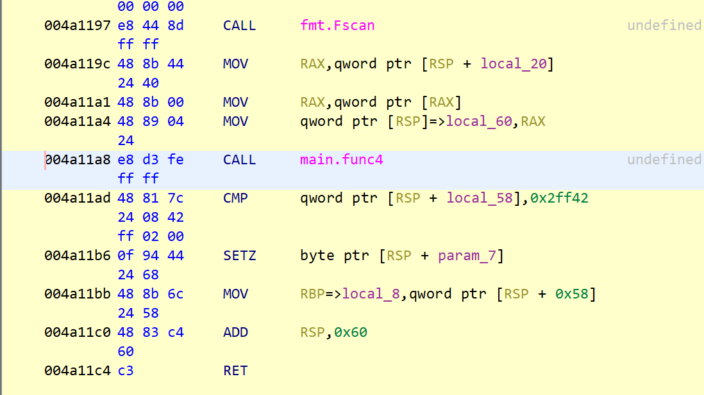

In `main.func4` the first parameter is checked and if it == 1 or == 0 then the function return. If not `main.func4` call itself 2 times.


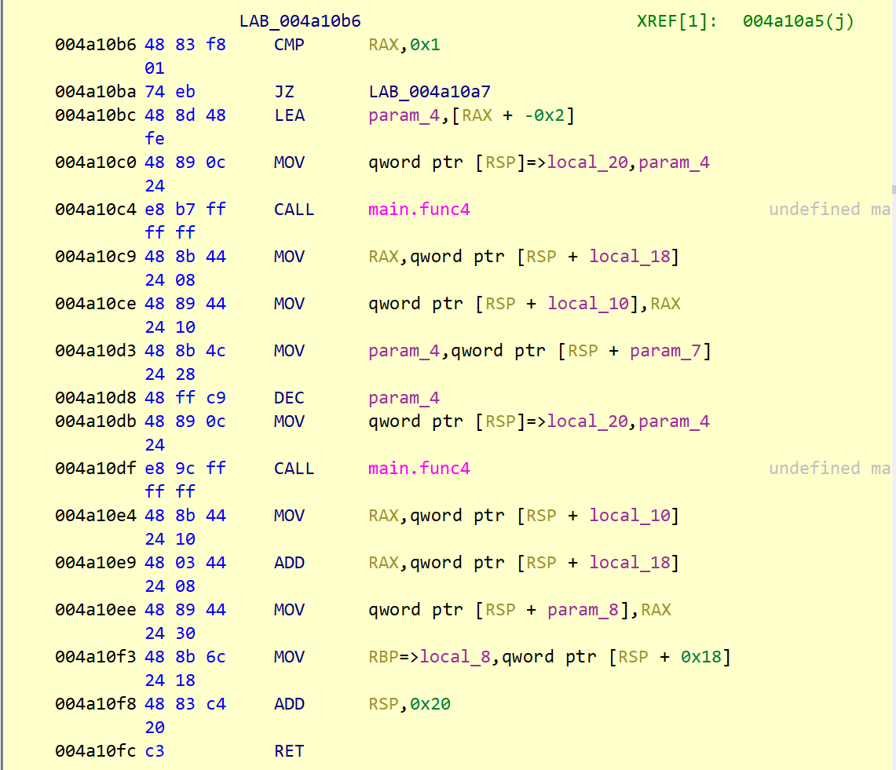

If `x` is the parameter passed to `main.func4` then `x-2` is passed to first call and `x-1` to second call.

A graph to explain how this function works:


A python script to auto solve:

```python
def calc(num):
	if (num != 0 and num != 1):
		temp1 = calc(num - 2)
		temp2 = calc(num - 1)
	elif (num == 0):
		return 0
	else:
		return 1
	return (temp1 + temp2)

num = 0
while(calc(num) != 0x2ff42):
	num += 1

print(num)
```

The result is `27`

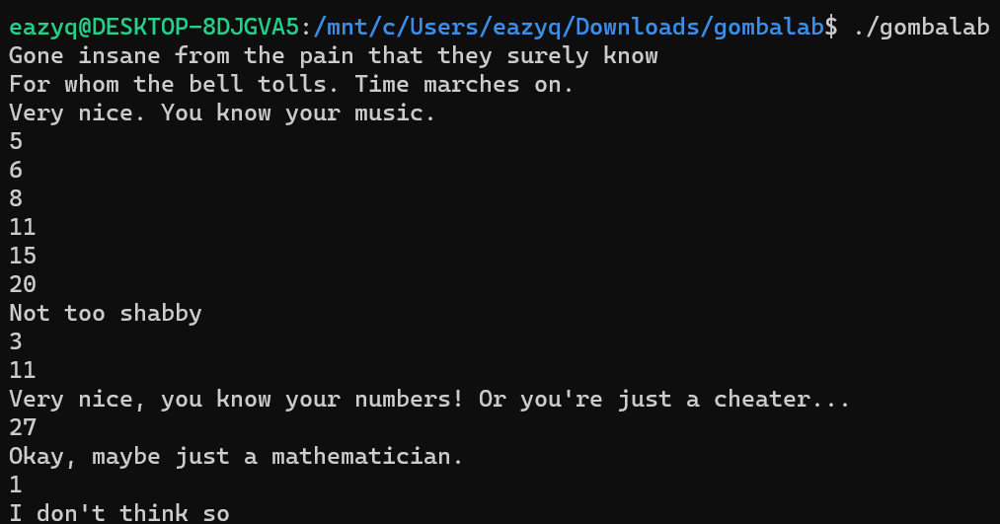

### main.phase5()


This time it asks for a string.

The `while` loop will deobfuscate it then check with `ratatouillelinguines` using `runtime.memequal()`

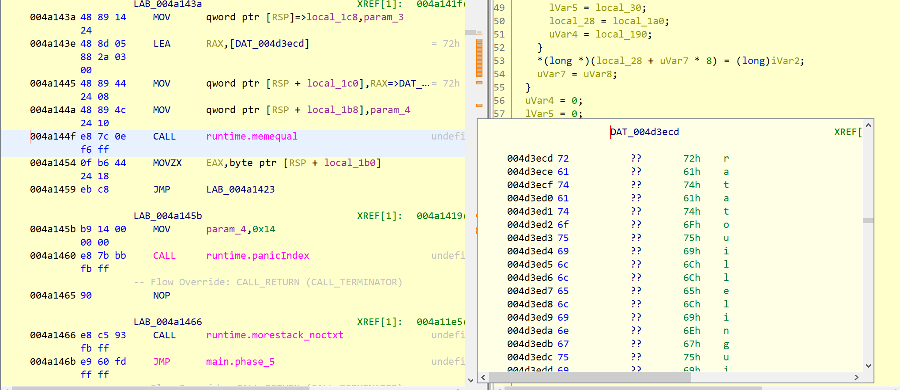

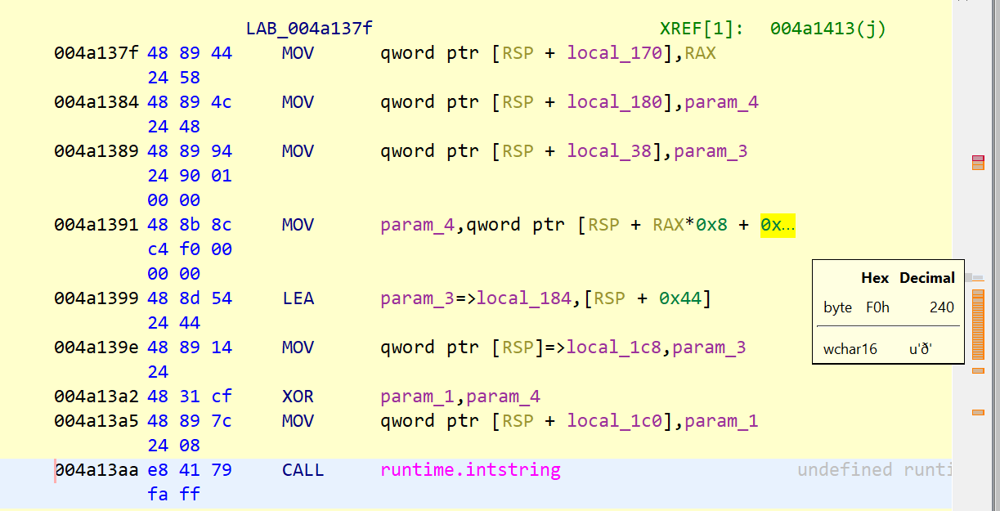

Each character in input string is xor-ed with byte in `[RSP + 0xF0]` so we just have to obtain the list from that address and xor with each char in `ratatouillelinguines`

```python
list1 = [ 0x45, 0x00, 0x00, 0x00, 0x00, 0x00, 0x00, 0x00, 0x54, 0x00, 0x00, 0x00, 0x00, 0x00, 0x00, 0x00, 0x44, 0x00, 0x00, 0x00, 0x00, 0x00, 0x00, 0x00, 0x35, 0x00, 0x00, 0x00, 0x00, 0x00, 0x00, 0x00, 0x3e, 0x00, 0x00, 0x00, 0x00, 0x00, 0x00, 0x00, 0x27, 0x00, 0x00, 0x00, 0x00, 0x00, 0x00, 0x00, 0x4d, 0x00, 0x00, 0x00, 0x00, 0x00, 0x00, 0x00, 0x5b, 0x00, 0x00, 0x00, 0x00, 0x00, 0x00, 0x00, 0x5a, 0x00, 0x00, 0x00, 0x00, 0x00, 0x00, 0x00, 0x2a, 0x00, 0x00, 0x00, 0x00, 0x00, 0x00, 0x00, 0x2d, 0x00, 0x00, 0x00, 0x00, 0x00, 0x00, 0x00, 0x26, 0x00, 0x00, 0x00, 0x00, 0x00, 0x00, 0x00, 0x20, 0x00, 0x00, 0x00, 0x00, 0x00, 0x00, 0x00, 0x5f, 0x00, 0x00, 0x00, 0x00, 0x00, 0x00, 0x00, 0x5f, 0x00, 0x00, 0x00, 0x00, 0x00, 0x00, 0x00, 0x46, 0x00, 0x00, 0x00, 0x00, 0x00, 0x00, 0x00, 0x3d, 0x00, 0x00, 0x00, 0x00, 0x00, 0x00, 0x00, 0x3c, 0x00, 0x00, 0x00, 0x00, 0x00, 0x00, 0x00, 0x23, 0x00, 0x00, 0x00, 0x00, 0x00, 0x00, 0x00, 0x4b, 0x00, 0x00, 0x00, 0x00, 0x00, 0x00, 0x00 ]

str1 = "ratatouillelinguines"

result = []
count = 0
for i in str1:
	result.append(chr(ord(i) ^ list1[count*8]))
	count += 1
print(''.join(result))

```

Result : `750TJH826FHJI183TRF8`


### main.phase6()

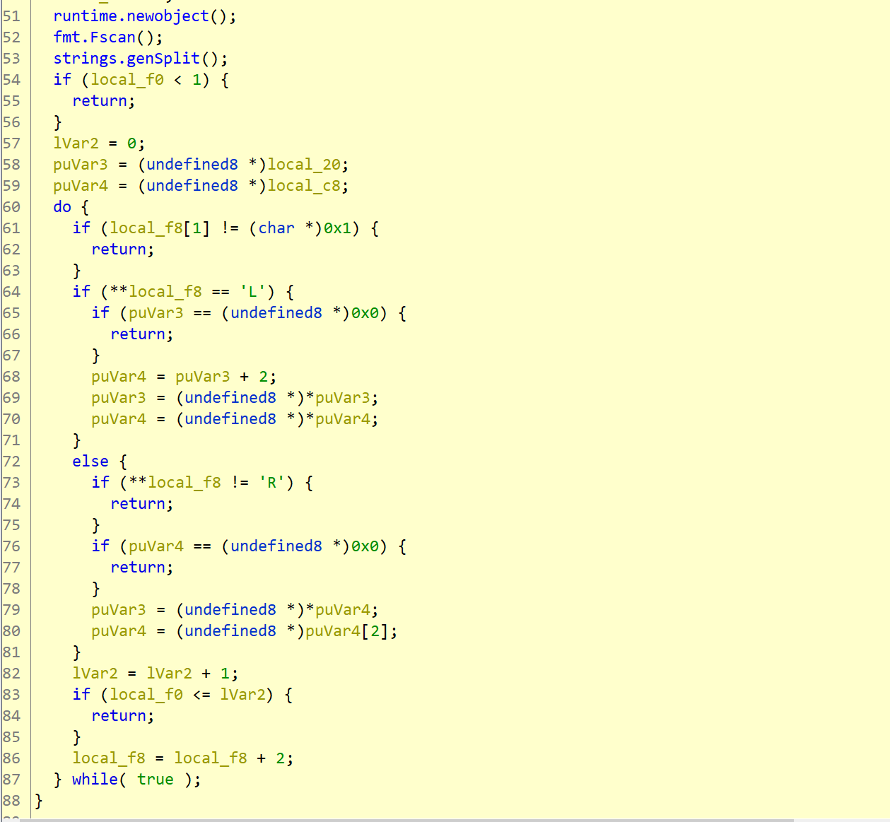

It asks for a string consist of `L` and `R` (left and right maybe?)

My ideal is to load this binary to a debugger and get the value of `puVar3` and `puVar4` before the `do while` loop

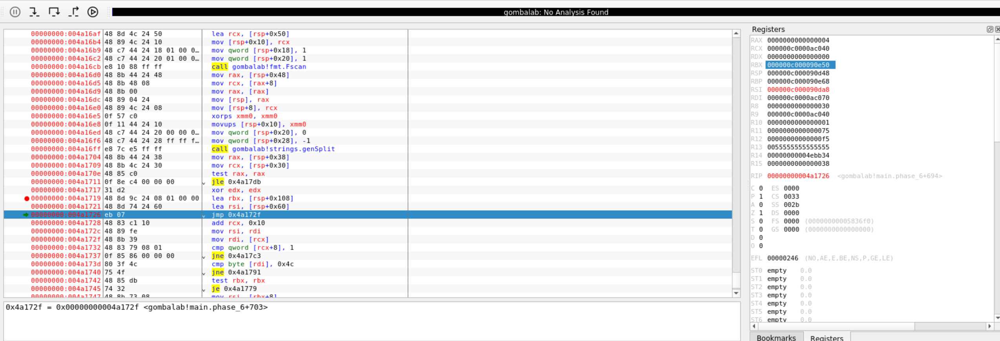

It is `000000c000090e50` in `RBX` and `000000c000090da8` in `RSI`

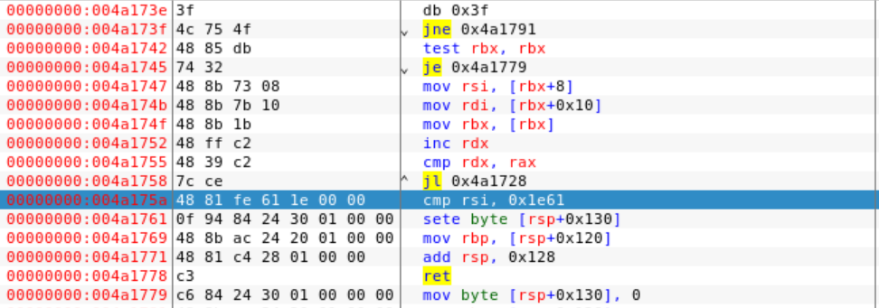

The result needs to be 0x1e61 and we can see it at address `000000c000090de0`

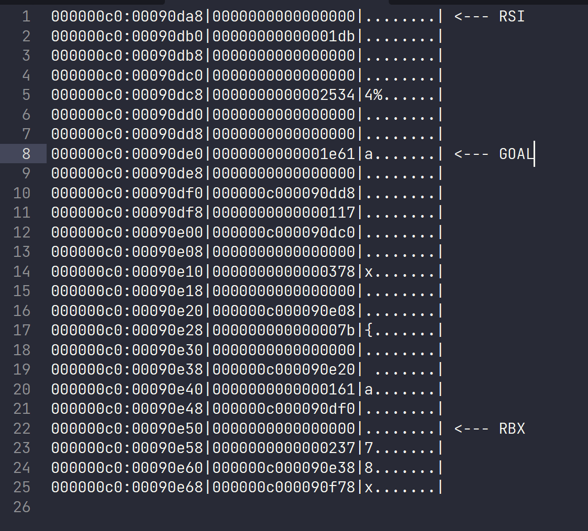

Each `L` or `R` command will change values of `RBX` and `RSI`

In the end if `RSI == 0x1e61` then the function return `1` 

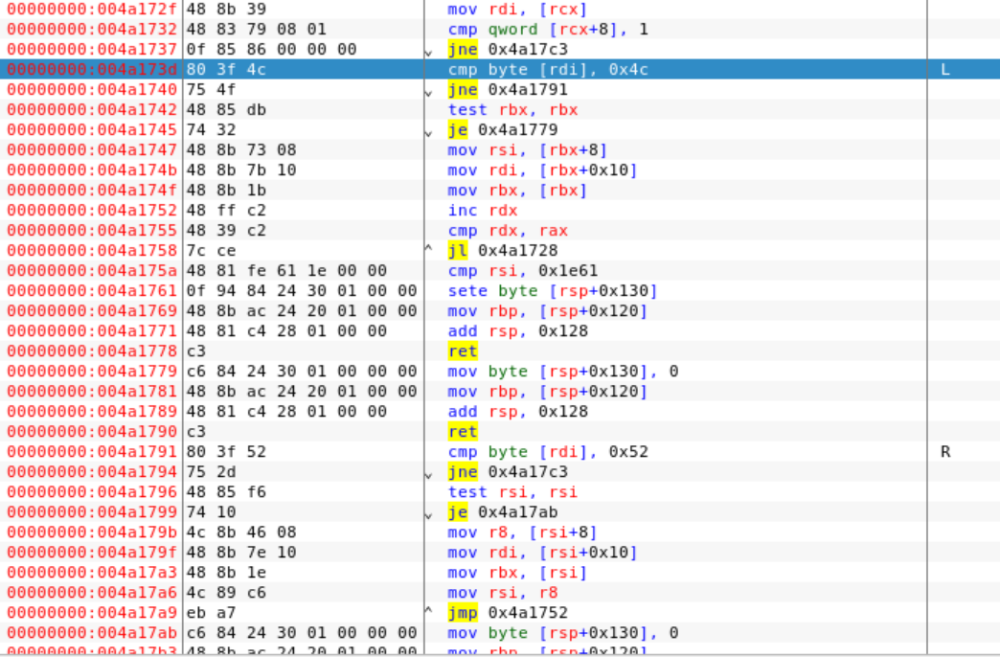

It's easy to see that the true path is `LRRL`

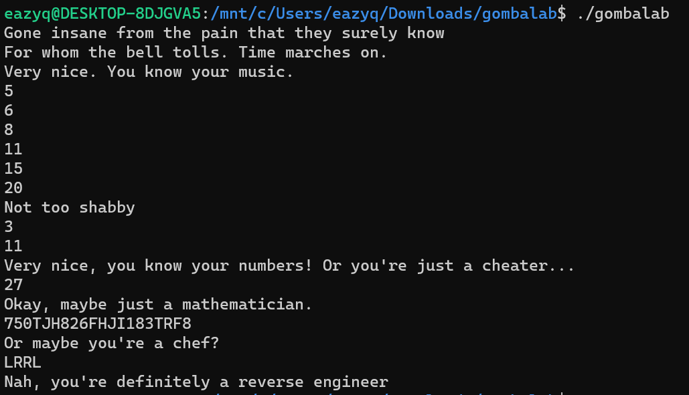

We have to ask admin and provide proof that we solved the challenge to get the flag:


