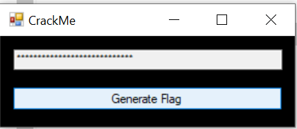
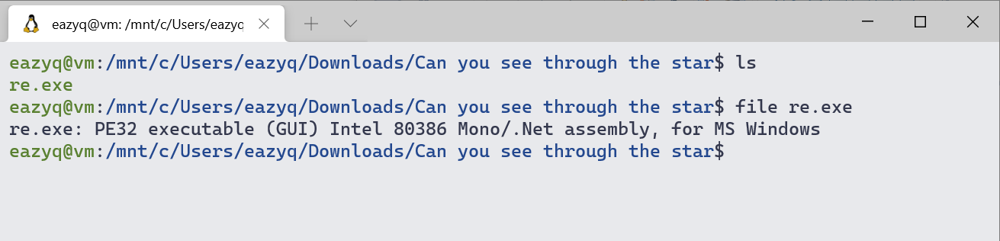
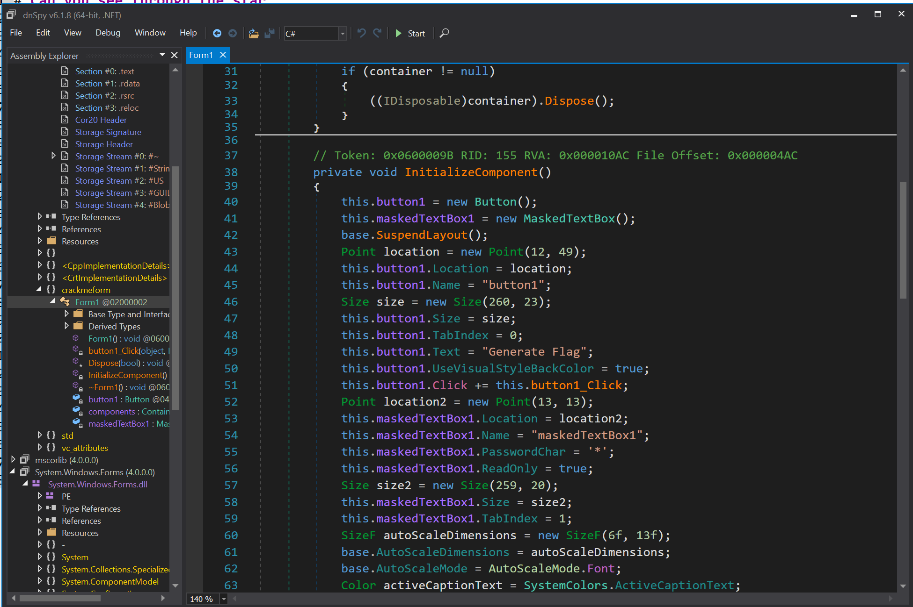
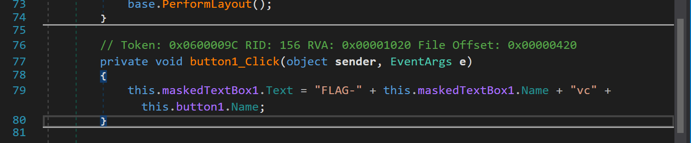

# Can you see through the star

### First sight

A .net binary, load it in dnspy and read the code

### Solve it

Here we can see all the strings for the GUI above

Scroll down a little bit we got this

Function `button1_Click` is the func that we need

`this.maskedTextBox1.Name` = `maskedTextBox1`

`this.button1.Name`        = `button1`

So the flag is `FLAG-maskedTextBox1vcbutton1`

