# [ASIS CTF Quals 2021](https://asisctf.com/): [beanstalk]

**Category:** RE
**Description:**

> You need to enter the license key before validating the flag. It's not easy!

##First look

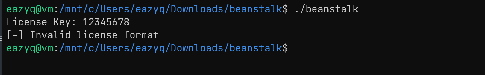 

The binary ask for a License Key and then check for it format

##Get the key format

In function main we can see the string "License Key: " and right after that at `0x00102b40` it call `std::cout` to print the string

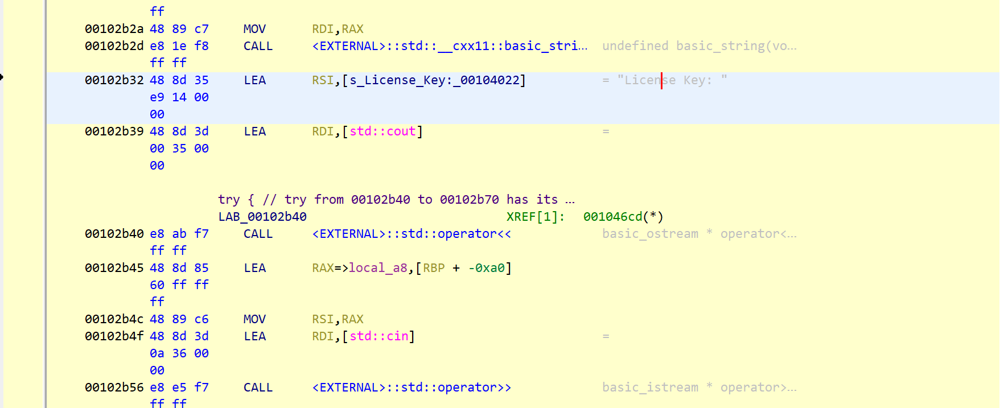

At `0x00102b56` `std::cin` is called to take the input (key) from user 

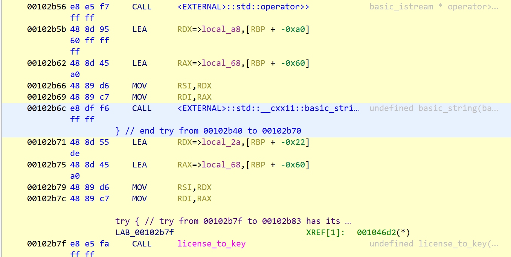

RDX now has a pointer to the address of input 
After the call to `std::basic_string` to make key become 
`basic_string` type, the input now passed into 
`license_to_key` function through RSI register

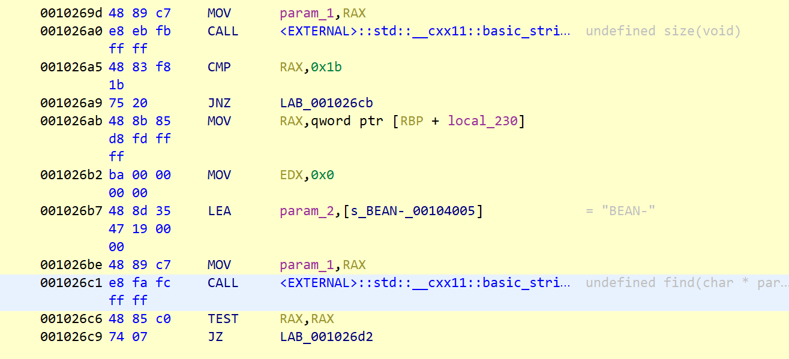

At `0x001026a0` `std::basic_string::size` is called and then being compared with 0x1b
At `0x001026c1` it find the string "BEAN-" in key and check the return number if it equal 0 or not

So now we know the license key must be 27 in size and started with "BEAN-"

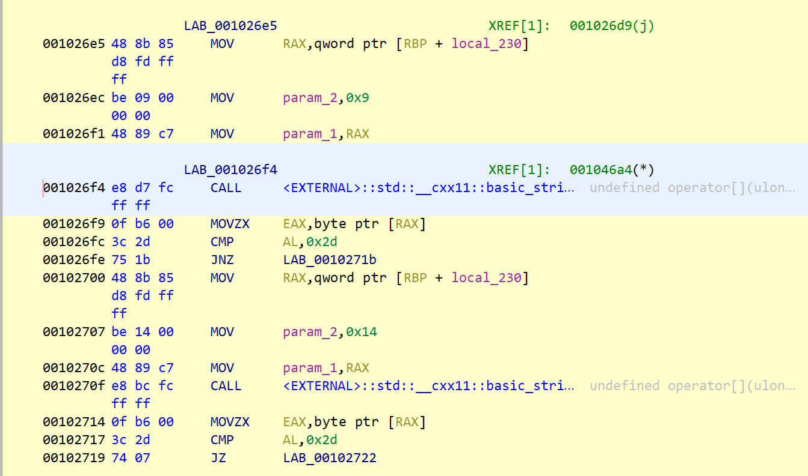

From `0x001026e5` to `0x001026fe` it passes 0x9 and key to 
`std::basic_string::operator[]` which return the char at index 0x9 from key to RAX
The char then being compared with 0x2d which is "-" in ascii table

The same thing happen from `0x00102700` to `0x00102717` but now index 0x14 is being checked

The license key is sth like this
`BEAN-xxxx-xxxxxxxxxx-xxxxxx`

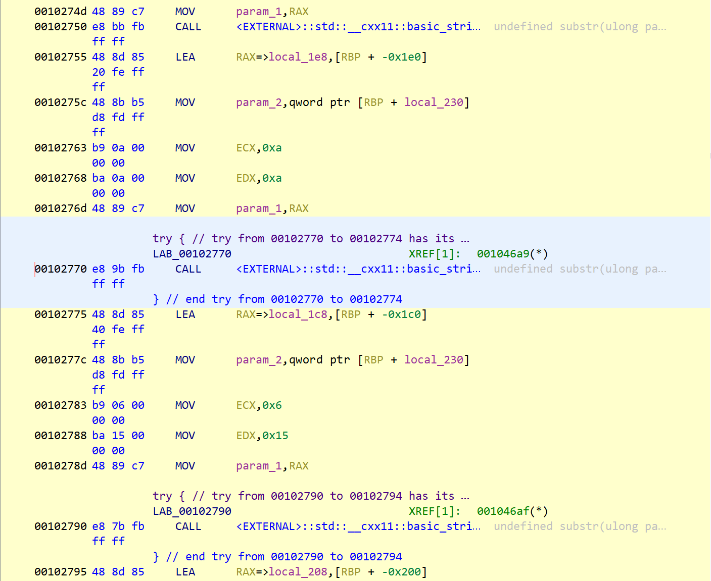

3 `std::basic_string::substr` function is called to seperate the key into 3 smaller strings (the "xx..." above)

Then the 3 new strings is checked if they contain any char that not in "0123456789abcdefABCDEF"

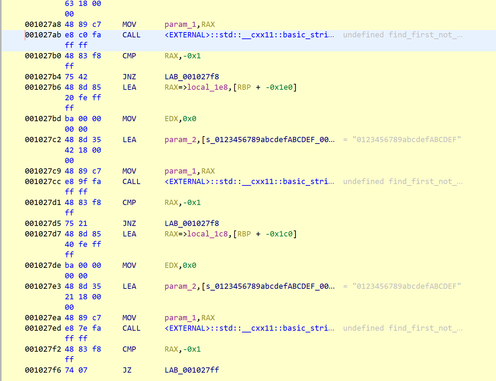

Now if we test `BEAN-aaaa-aaaaaaaaaa-aaaaaa`

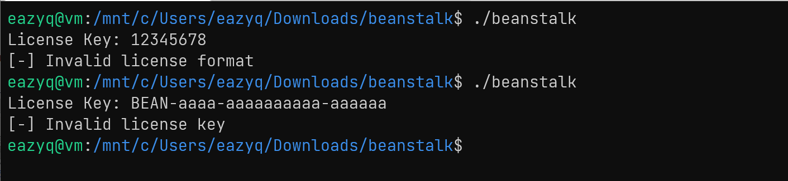 

 

The format was right
The remaining part of `license_to_key` function is just storing 3 small string to `param_2` in reverse order like this
ex: BEAN-1234-abcdefghjk-567890
->  43.21.kj.hg.fe.dc.ba.09.87.65


##Get the key
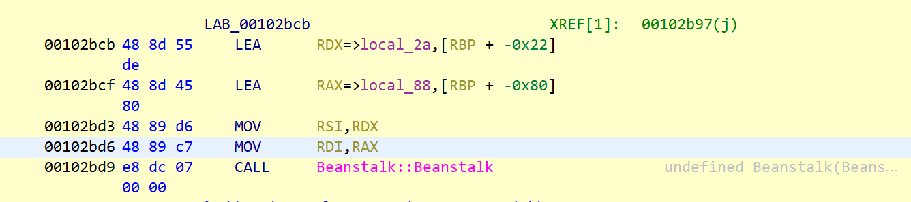 

Now the address of re-ordered sequence of hex is passed to 
`Beanstalk` function as second parameter through RSI

Analysing through the binary i relized that `Beanstalk` function will use the hex from second parameter to generate a key2 which is 10 in size
I use decompiler to see the whole algorithm

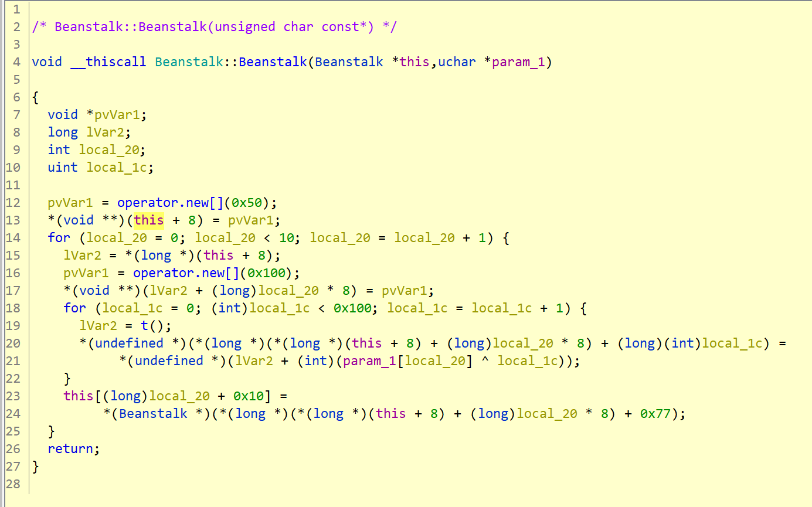 


First it allocate 0x50 = 80 bytes and return pointer to first 8 bytes to `pvVar1`
Line 16 allocate 0x100 = 160 bytes and return pointer to the first 8 bytes which was allocated earlier
The first loop loop 10 times so this is what we have

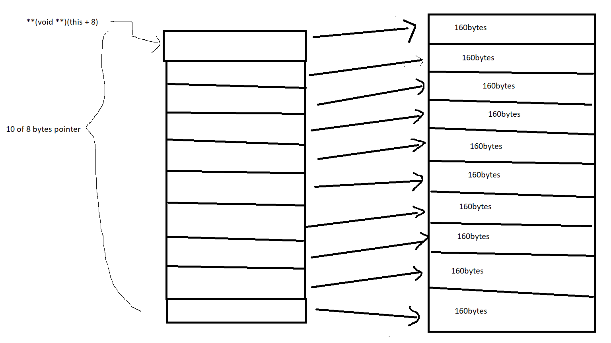

At line 19 function `t()` generates a table and line 20 21 will use that table to fill the 160bytes which was allocated

Load binary to edb-debugger and place breakpoint at function t() then we will have table's address in RAX: [stack1](script/stack1)

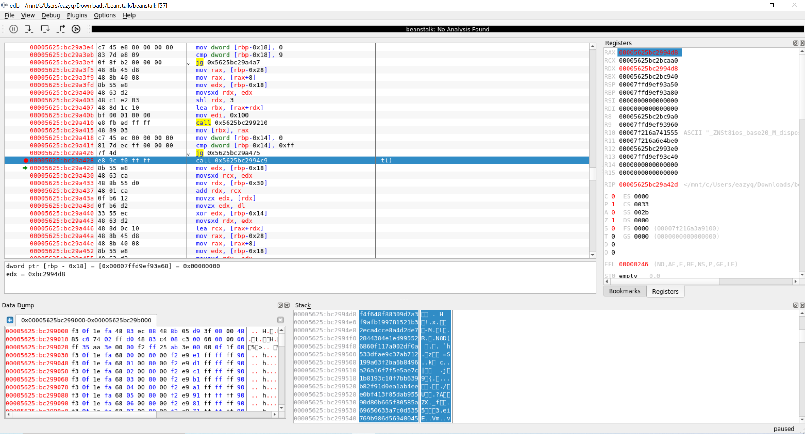

From line 23 to 24 the bytes at index 0x77 will be placed into the key2
So if we know key2 we will find the license key we need

Back to `main` function

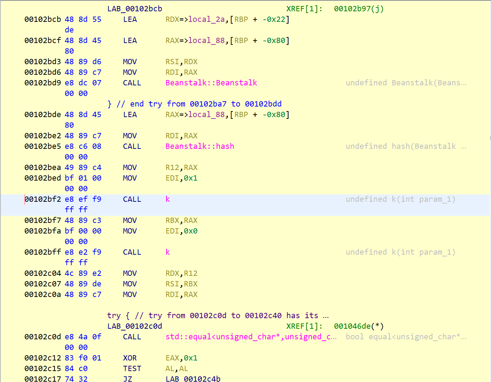

After `Beanstalk` key2 is passed to hash
The return value from `hash`, `k` and `k` are passed to 
`std::equal` so we know the two `k` will generate the true key2

By running the binary in edb-debugger we get these values

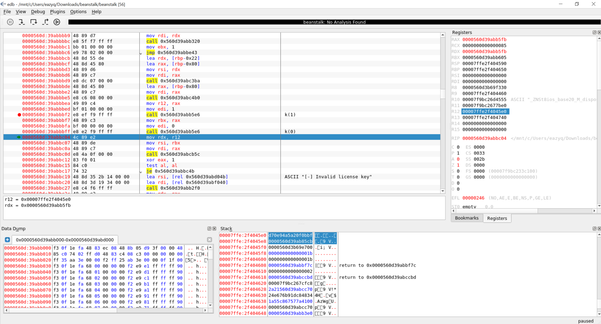

key2 is 10bytes so we have:

`key2 = 0xbf0b0fa2a5940ed7cb85`

Back to `Beanstalk` fuction we now can find the license key

```python
key2 = [0xbf,0x0b,0x0f,0xa2,0xa5,0x94,0x0e,0xd7,0xcb,0x85]
data = []
index = []

with open("stack1.txt") as file:
    for line in file:
        i = 32
        while (i > 17):
        	data.append(int(line[i : i + 2], 16))
        	i -= 2

for k in key2:
	indices = [i for i, x in enumerate(data) if x == k]
	index.append(hex(indices[0] ^ 0x77)[2:])

result = ''.join(index)
print(result)
```

Run the script above we will have `212a3448c81db976e624`
If we rearrange the output we will have license key: 
`BEAN-2a21-b91dc84834-24e676`


The key was right, but it seems that we still have another task to do
