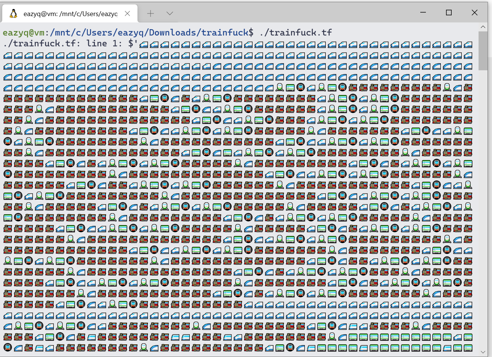
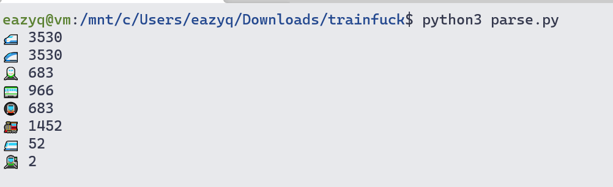
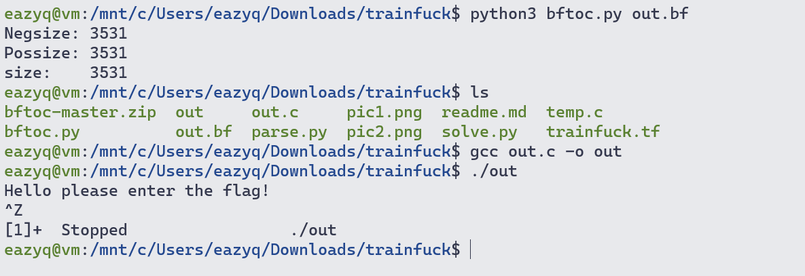
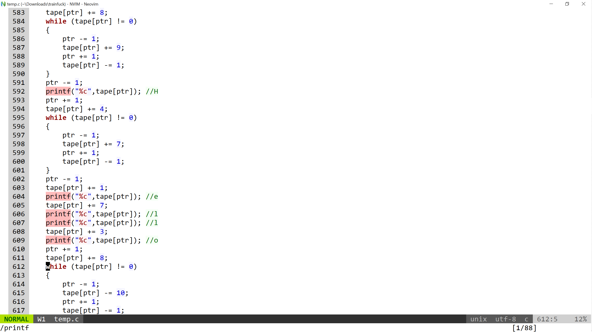
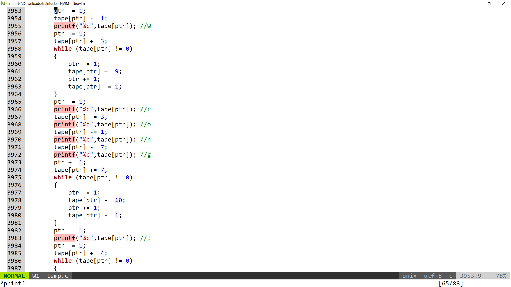
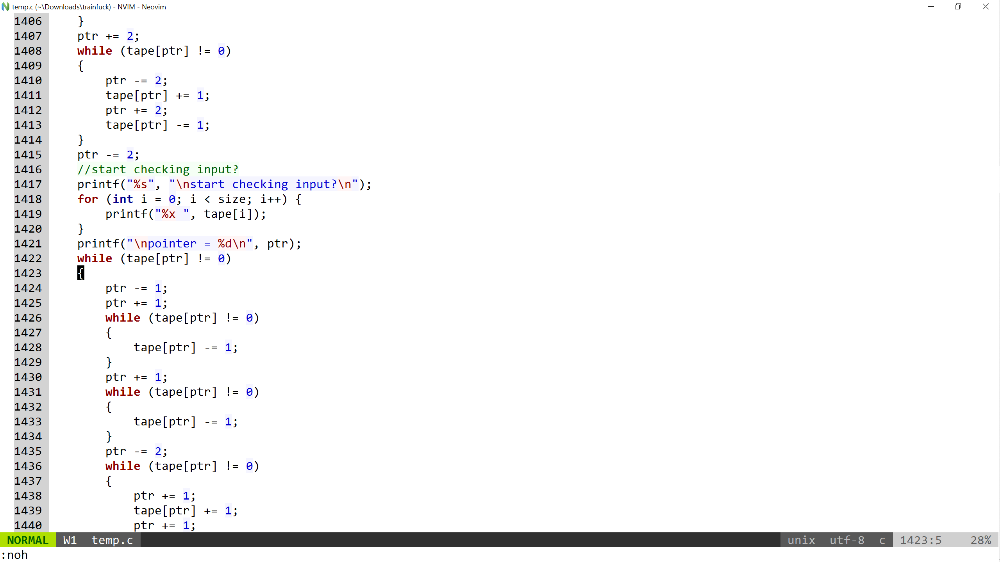
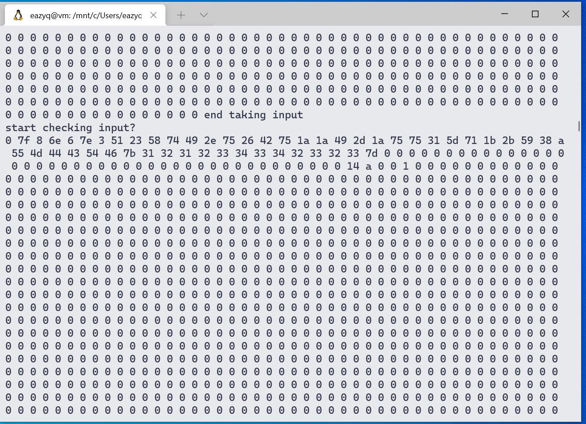
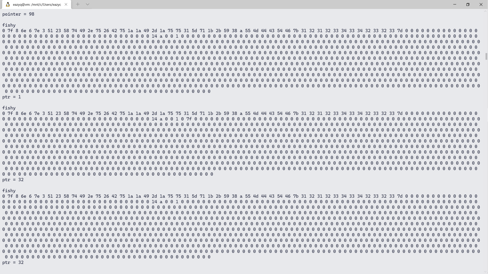
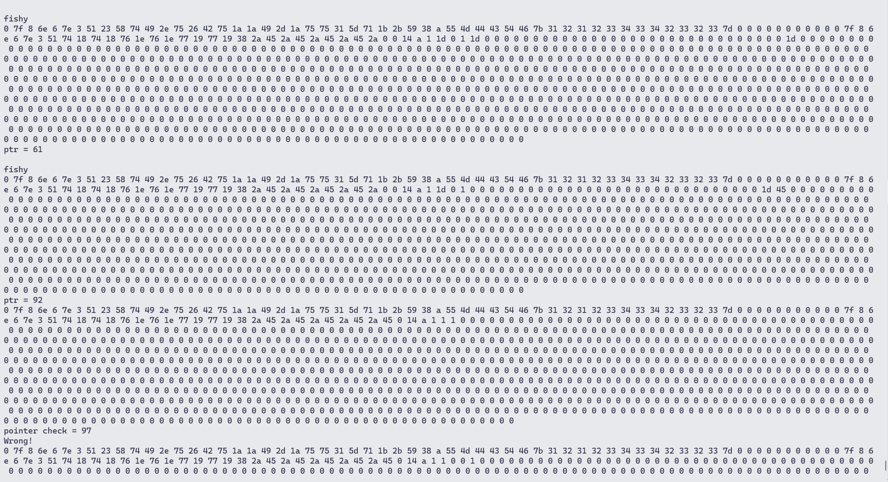
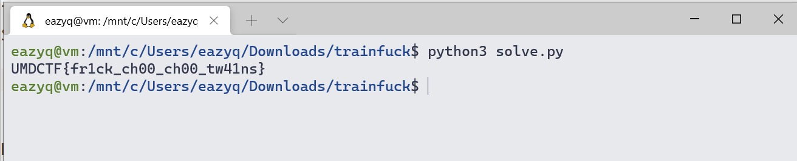

# trainfuck 

## Category : RE
## Points   : 961

### First look

A .tf file that contains many train chars




### Trying to parse the file
Open file in HxD show that there are 8 different chars

So it turns out `trainfuck` is like `brainfuck`
By paying attention to the pattern of all these trains it's easy to find the mapping of these chars

```python
#!/usr/bin/python3
# -*- coding:utf-8 -*-

data = open('./trainfuck.tf', 'r').read()
data = data[:-1]
mapping = {
    '🚅': '>',
    '🚄': '<',
    '🚆': '[',
    '🚃': '-',
    '🚇': ']',
    '🚂': '+',
    '🚈': '.',
    '🚉': ','
}

c = {}

for char in data:
    if char not in c:
        c[char] = 1
    else:
        c[char] += 1

for i in c:
    print(i, c[i])

for k in mapping:
    data = data.replace(k, mapping[k])

with open('./out.bf', 'w+') as f :
    f.write(data)
```





We can use this script to turn .bf file to .c 

https://github.com/paulkaefer/bftoc





### Reverse the .c file

The binary first ask for input and cost shit tons of time to print `Wrong!\n`

By open the .c file we can see there is a lot of `while` loop

Searching the `printf` func show us :







They are the parts that give output

We need to find the part that take input

In the code of the tool use to convert .bf file, `,` = `getchar()`

There are 2 matches for `getchar()` in .c file

The first one is not in a `loop` but the second one is, the binary only ask for 1 strings anyway

I decided that input part is not really important and start finding the flag checking part

By reverse a few (30?) lines of code before the `Wrong!` part we can see there is a big loop which start at line `1422` and end at `3861` (in temp.c file)


That should be the check part




I tried to view the buffer before the check




We can see `55 4d 44 43 54 ....` is our input
So what are those bytes before that part?

Start reading through the check part, there are several line like `ptr -= 101 (a huge number)` which are really strange
That must be the program tries to switch between blocks of data
So by adding `for` loop before each of these line to view the buffer, we may relize the algo if it's simple enough




Here `ptr = 1` is `7f` and `ptr = 32` is `55` which is the first char `U`
The algo must be doing sth with one char at a time and then compare it with `7f`





Here the third block of data contains things to compare
We can see for each char there is only 1 result so we maybe can brute-force to get the flag

But the pattern is quite clear that the algo must be simple xor 

```python
arr1 = [0x7f,0x8,0x6e,0x6,0x7e,0x3,0x51,0x23,0x58,0x74,0x49,0x2e,0x75,0x26,0x42,0x75,0x1a,0x1a,0x49,0x2d,0x1a,0x75,0x75,0x31,0x5d,0x71,0x1b,0x2b,0x59,0x38,0xa]
flag = []
count = 0
for i in arr1:
    if (count % 2 == 0):
        flag.append(chr(i ^ 0x2a))
    else:
        flag.append(chr(i ^ 0x45))
    count += 1
print(''.join(flag))
```





