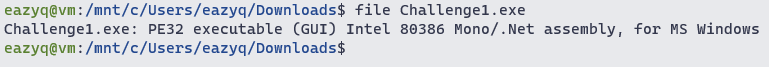
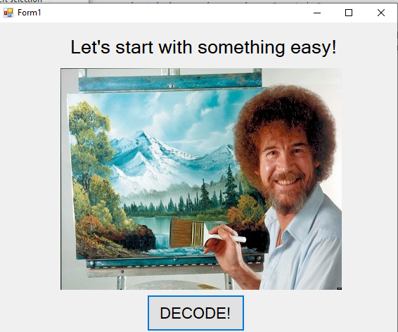
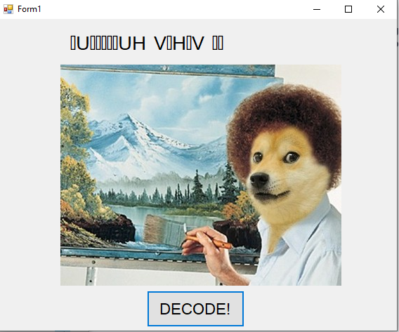
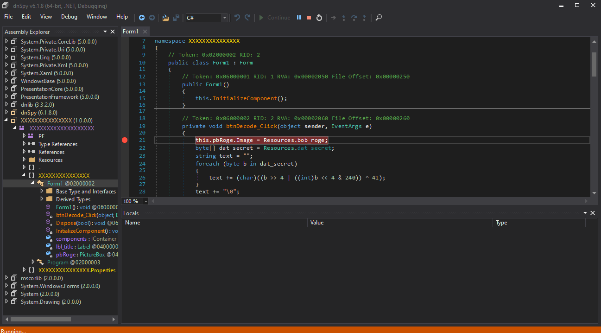
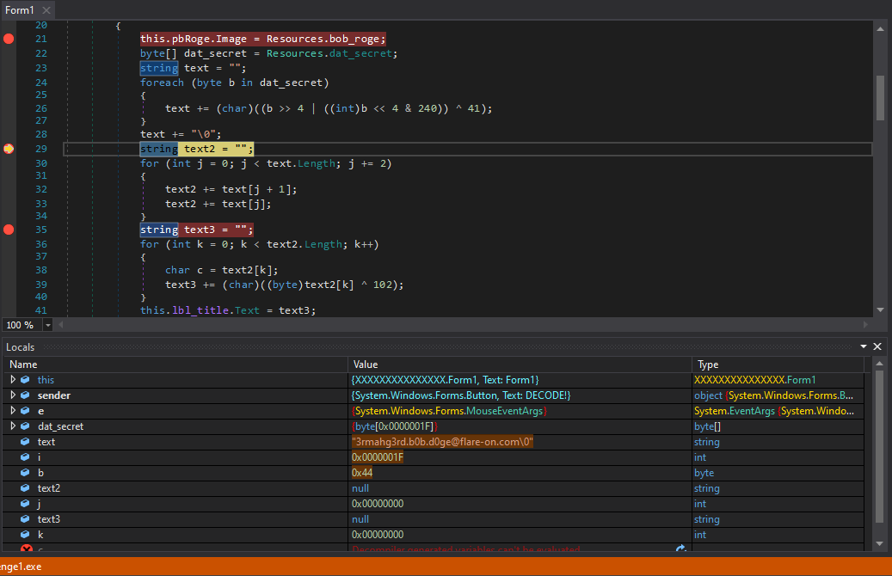

# Challenge 1

Try to run the binary show us this

Try to click the `DECODE!` button

Load the binary to dnSpy we can see `btnDecode_Click` function that has some math in it
Set a breakpoint and run, then click the button

The breakpoint hit, set a few more breakpoints at line 29 and 35 then continue the program

Here we can see the flag

3rmahg3rd.b0b.d0ge@flare-on.com
