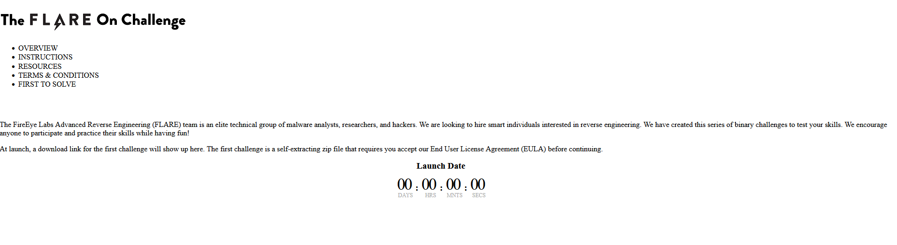
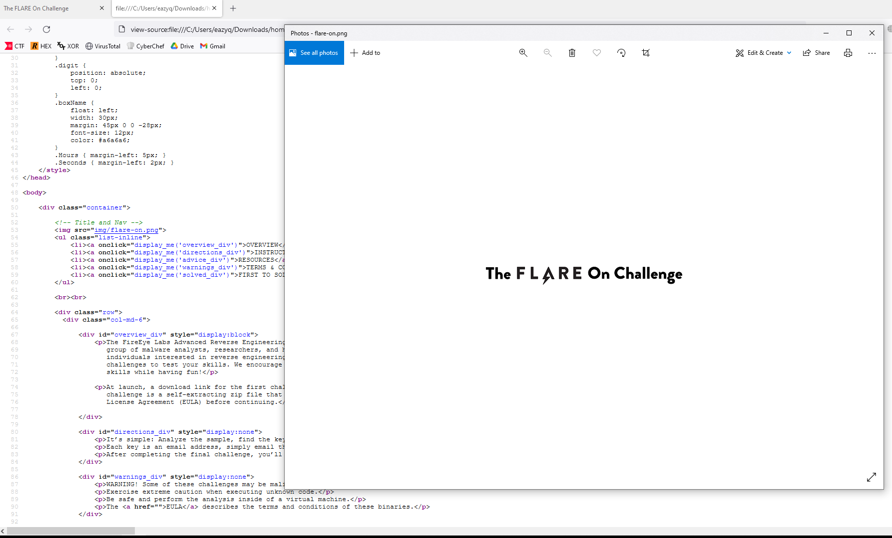
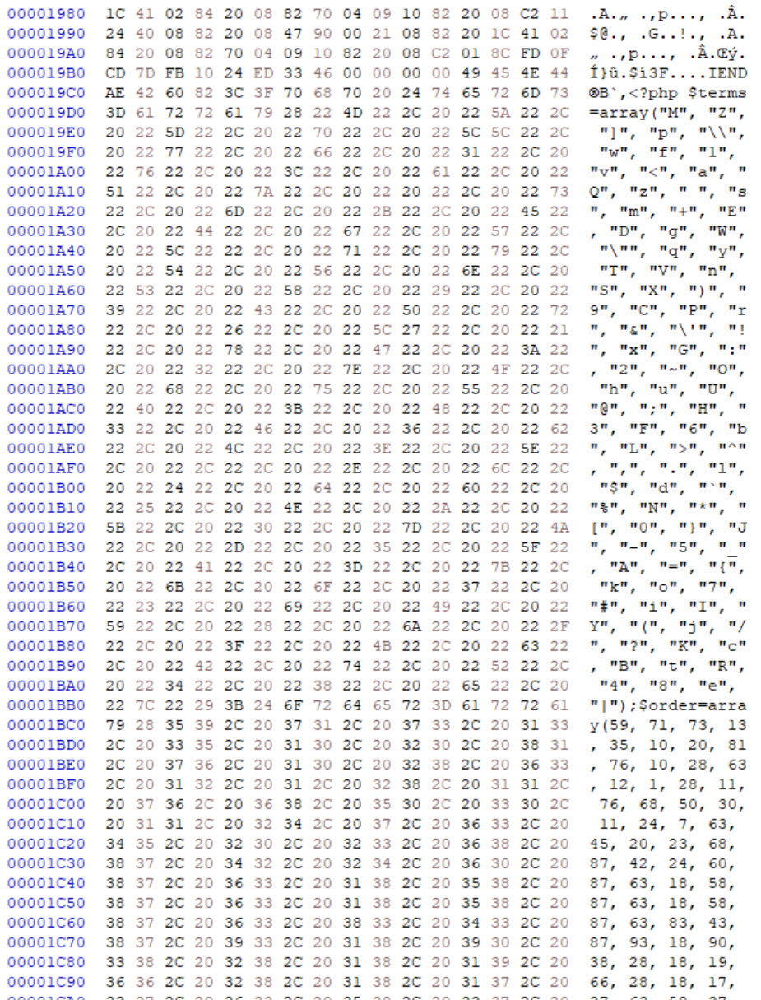
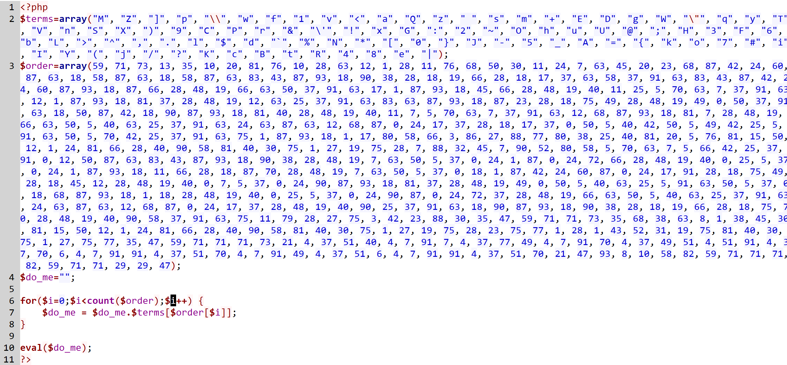
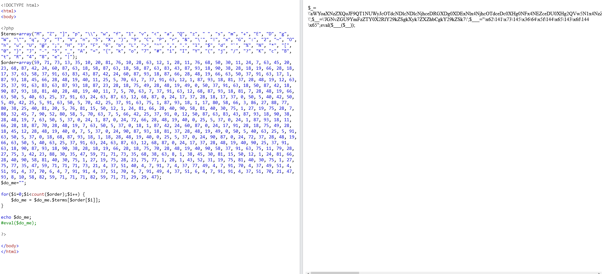
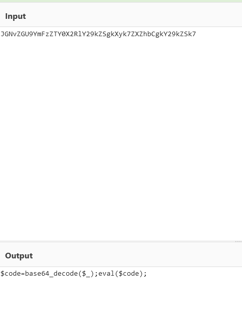
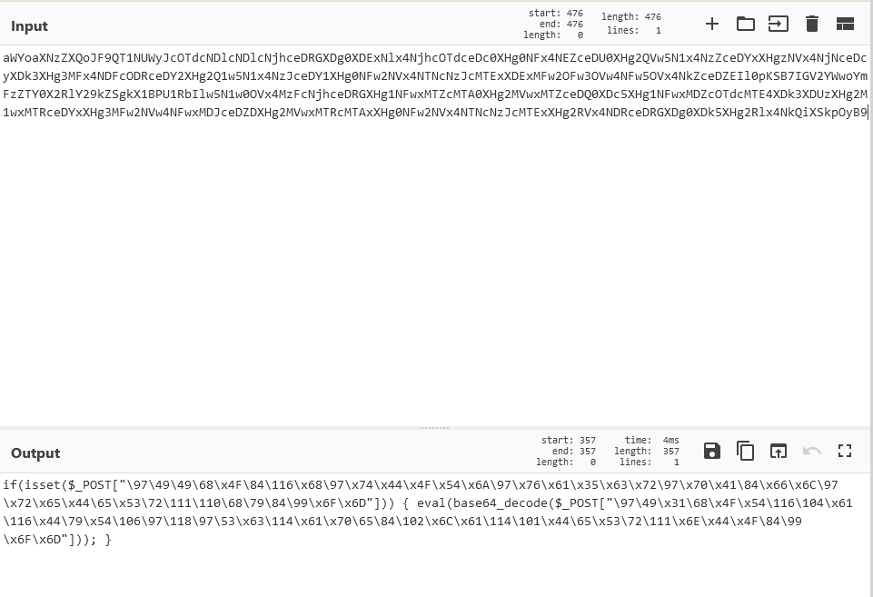
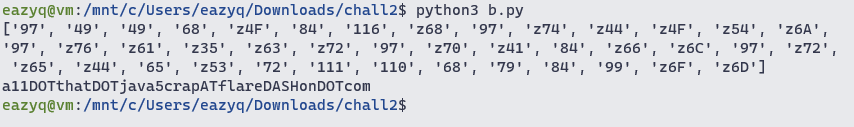

#Challenge 2

The chall has an .html file and an `img` folder contains an .png file

Run the .html file



Playing around this website i can see there is nothing special

Let's inspect the .png file



Nothing special, again?

Maybe there is smth sus in the binary of .png file, load it in HxD show us this



Use this script to dump the code

```python
with open("flare-on.png", "rb") as f:
    f.seek(0x19c4)
    a = f.read()
    with open("out.php", "wb") as w:
        w.write(bytearray(a))
```

These are the content of .php file



Copy paste the file to an online compiler, we want to know what `$do_me` is

The content of `$do_me` 



We can see there are 3 var

The one with 3 `_` is `base64decode`

So it decode 2 `_` from base64 and run the result



Now it decode 1 `_` and run



These code check if the var in $_POST then decode and run it

It's looks like some ascii chars

Replace `\` with `c` and `x` with `z` and run this python script we will got the flag

```python
a = str("c97c49c49c68cz4Fc84c116cz68c97cz74cz44cz4Fcz54cz6Ac97cz76cz61cz35cz63cz72c97cz70cz41c84cz66cz6Cc97cz72cz65cz44c65cz53c72c111c110c68c79c84c99cz6Fcz6D")

a = a.split("c")[1:]
print(a)
result = ""
for i in a:
    if i[0] == "z":
        result += chr(int(i[1:], 16))
    else:
        result += chr(int(i))

print(result)

```



`a11.that.java5crap@flare-on.com`


