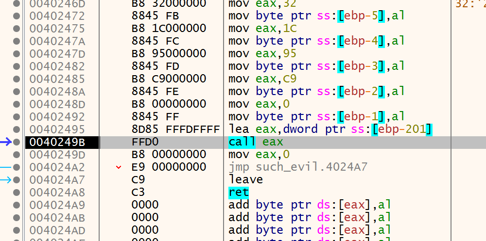

# Challenge 3

Load the file to IDA, we can see it tries to write byte to memory and then execute it

It is better to dynamic analysis this binary

Load it to x32dbg, set bp before the call and then run

Step into that call, the program again unpack itself by xoring bytes at `19fd34 + 1c` with `0x66`

So the chall is about file unpacking itself

Keep tracing until we cant and see the flag in memory

`such.5h311010101@flare-on.com`
