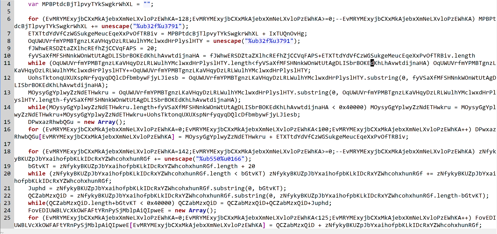
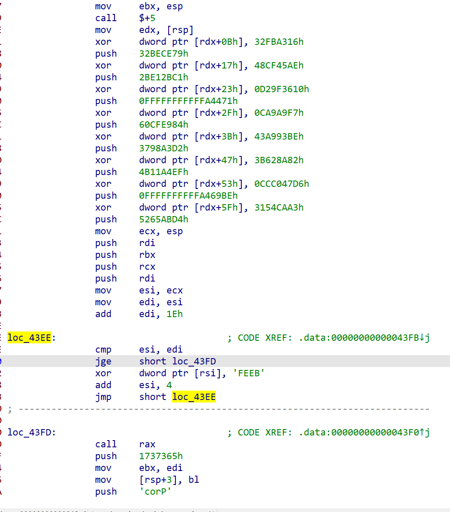

# Challenge 4


Load this pdf file to `pdfwalker` we can see there is some sus javascript code

Dump that to a file and start analyze




The second half is consist of just `for` and `while` loop so it might not be interesting

The first half contains a sth that looks like a shellcode 

Try to decode it with this script

`````python

shellcode = "%u72f9%u4649%u1525%u7f0d%u3d3c%ue084%ud62a%ue139%ua84a%u76b9%u9824%u7378%u7d71%u757f%u2076%u96d4%uba91%u1970%ub8f9%ue232%u467b%u9ba8%ufe01%uc7c6%ue3c1%u7e24%u437c%ue180%ub115%ub3b2%u4f66%u27b6%u9f3c%u7a4e%u412d%ubbbf%u7705%uf528%u9293%u9990%ua998%u0a47%u14eb%u3d49%u484b%u372f%ub98d%u3478%u0bb4%ud5d2%ue031%u3572%ud610%u6740%u2bbe%u4afd%u041c%u3f97%ufc3a%u7479%u421d%ub7b5%u0c2c%u130d%u25f8%u76b0%u4e79%u7bb1%u0c66%u2dbb%u911c%ua92f%ub82c%u8db0%u0d7e%u3b96%u49d4%ud56b%u03b7%ue1f7%u467d%u77b9%u3d42%u111d%u67e0%u4b92%ueb85%u2471%u9b48%uf902%u4f15%u04ba%ue300%u8727%u9fd6%u4770%u187a%u73e2%ufd1b%u2574%u437c%u4190%u97b6%u1499%u783c%u8337%ub3f8%u7235%u693f%u98f5%u7fbe%u4a75%ub493%ub5a8%u21bf%ufcd0%u3440%u057b%ub2b2%u7c71%u814e%u22e1%u04eb%u884a%u2ce2%u492d%u8d42%u75b3%uf523%u727f%ufc0b%u0197%ud3f7%u90f9%u41be%ua81c%u7d25%ub135%u7978%uf80a%ufd32%u769b%u921d%ubbb4%u77b8%u707e%u4073%u0c7a%ud689%u2491%u1446%u9fba%uc087%u0dd4%u4bb0%ub62f%ue381%u0574%u3fb9%u1b67%u93d5%u8396%u66e0%u47b5%u98b7%u153c%ua934%u3748%u3d27%u4f75%u8cbf%u43e2%ub899%u3873%u7deb%u257a%uf985%ubb8d%u7f91%u9667%ub292%u4879%u4a3c%ud433%u97a9%u377e%ub347%u933d%u0524%u9f3f%ue139%u3571%u23b4%ua8d6%u8814%uf8d1%u4272%u76ba%ufd08%ube41%ub54b%u150d%u4377%u1174%u78e3%ue020%u041c%u40bf%ud510%ub727%u70b1%uf52b%u222f%u4efc%u989b%u901d%ub62c%u4f7c%u342d%u0c66%ub099%u7b49%u787a%u7f7e%u7d73%ub946%ub091%u928d%u90bf%u21b7%ue0f6%u134b%u29f5%u67eb%u2577%ue186%u2a05%u66d6%ua8b9%u1535%u4296%u3498%ub199%ub4ba%ub52c%uf812%u4f93%u7b76%u3079%ubefd%u3f71%u4e40%u7cb3%u2775%ue209%u4324%u0c70%u182d%u02e3%u4af9%ubb47%u41b6%u729f%u9748%ud480%ud528%u749b%u1c3c%ufc84%u497d%u7eb8%ud26b%u1de0%u0d76%u3174%u14eb%u3770%u71a9%u723d%ub246%u2f78%u047f%ub6a9%u1c7b%u3a73%u3ce1%u19be%u34f9%ud500%u037a%ue2f8%ub024%ufd4e%u3d79%u7596%u9b15%u7c49%ub42f%u9f4f%u4799%uc13b%ue3d0%u4014%u903f%u41bf%u4397%ub88d%ub548%u0d77%u4ab2%u2d93%u9267%ub198%ufc1a%ud4b9%ub32c%ubaf5%u690c%u91d6%u04a8%u1dbb%u4666%u2505%u35b7%u3742%u4b27%ufc90%ud233%u30b2%uff64%u5a32%u528b%u8b0c%u1452%u728b%u3328%ub1c9%u3318%u33ff%uacc0%u613c%u027c%u202c%ucfc1%u030d%ue2f8%u81f0%u5bff%u4abc%u8b6a%u105a%u128b%uda75%u538b%u033c%uffd3%u3472%u528b%u0378%u8bd3%u2072%uf303%uc933%uad41%uc303%u3881%u6547%u5074%uf475%u7881%u7204%u636f%u7541%u81eb%u0878%u6464%u6572%ue275%u8b49%u2472%uf303%u8b66%u4e0c%u728b%u031c%u8bf3%u8e14%ud303%u3352%u57ff%u6168%u7972%u6841%u694c%u7262%u4c68%u616f%u5464%uff53%u68d2%u3233%u0101%u8966%u247c%u6802%u7375%u7265%uff54%u68d0%u786f%u0141%udf8b%u5c88%u0324%u6168%u6567%u6842%u654d%u7373%u5054%u54ff%u2c24%u6857%u2144%u2121%u4f68%u4e57%u8b45%ue8dc%u0000%u0000%u148b%u8124%u0b72%ua316%u32fb%u7968%ubece%u8132%u1772%u45ae%u48cf%uc168%ue12b%u812b%u2372%u3610%ud29f%u7168%ufa44%u81ff%u2f72%ua9f7%u0ca9%u8468%ucfe9%u8160%u3b72%u93be%u43a9%ud268%u98a3%u8137%u4772%u8a82%u3b62%uef68%u11a4%u814b%u5372%u47d6%uccc0%ube68%ua469%u81ff%u5f72%ucaa3%u3154%ud468%u65ab%u8b52%u57cc%u5153%u8b57%u89f1%u83f7%u1ec7%ufe39%u0b7d%u3681%u4542%u4645%uc683%ueb04%ufff1%u68d0%u7365%u0173%udf8b%u5c88%u0324%u5068%u6f72%u6863%u7845%u7469%uff54%u2474%uff40%u2454%u5740%ud0ff"

n = 6
chunks = [shellcode[i:i+n] for i in range(0, len(shellcode), n)]
arr1 = []
for i in chunks:
    arr1.append(i[4:6])
    arr1.append(i[2:4])

shellcode = ""
for i in arr1:
    shellcode += i

with open ("payload", "wb") as f:
    for i in arr1:
        f.write(bytes.fromhex(i))


c_file =  "#include <stdio.h>\n\n"
c_file += "static char shellcode[] = \""
for i in arr1:
    c_file += "\\"
    c_file += "x"
    c_file += i
c_file += "\";"
c_file += "\n\n"
c_file += "int main(int argc, char *argv[])\n"
c_file += "{\n"
c_file += "  void (*code)() = (void *)shellcode;\n"
c_file += "  code();\n"
c_file += "  exit(0);\n"
c_file += "}\n"
c_file += "\n"
print(c_file)
with open("payload.c", "w") as f:
    f.write(c_file)

`````

Now we have an .c file that contain and run shellcode

Let's compile and throw it to IDA

Here we can see some interesting functions


Nothing here hint us about the flag

Below that the program unpack it self, after that some memory is xored with key `BEEF` and then program exit



So this sections must contain flag

Load the program to x64dbg, set bp and run


`wa1ch.d3m.spl01ts@flare-on.com`

