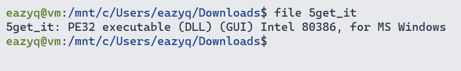
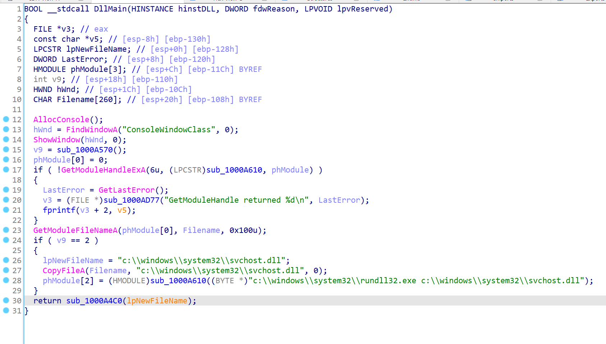
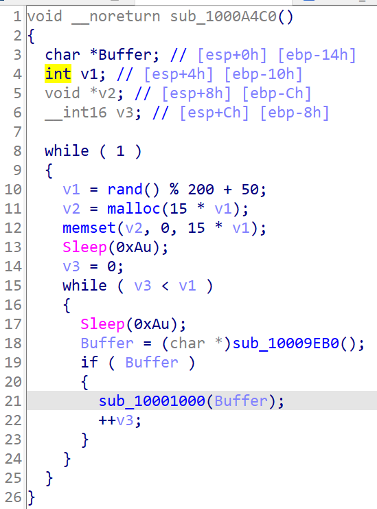
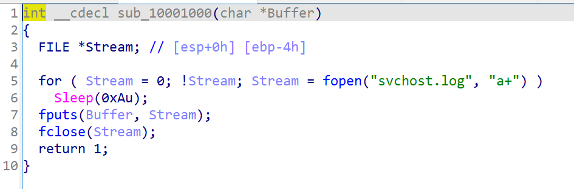
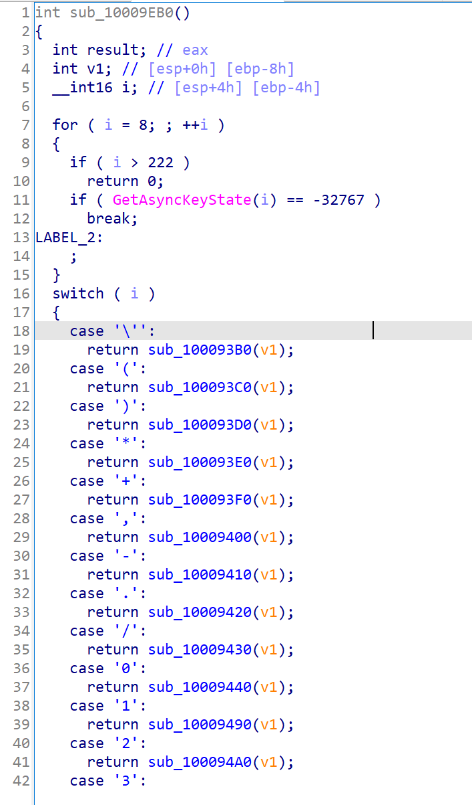
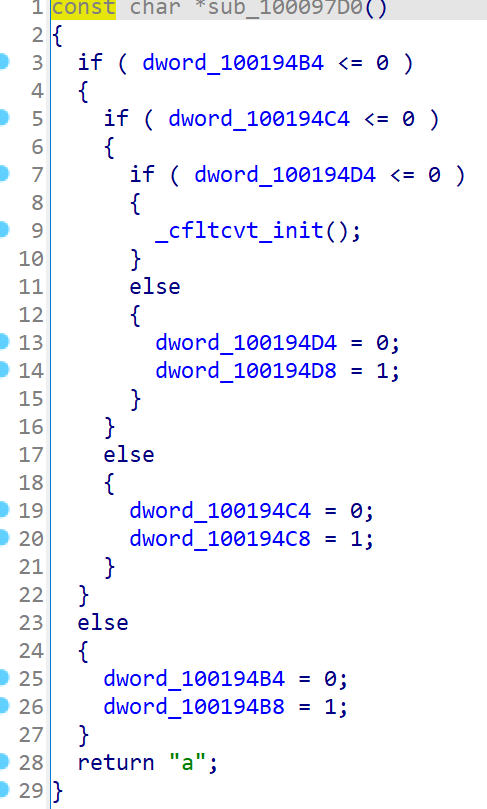

# Challenge 5

Load the file to IDA

The program add some reg key to make it auto start when the computer start up

Start analyzing `sub_1000A4C0`

Function `sub_10001000` seems to write the return value from `sub_10009EB0` to a file

Maybe this is a keylogger

Start analyzing `sub_10009EB0`

This is 100% a keylogger

Some of these function just return the input char, some has `_cfltcvt_init` func that initialize an array

But there are some function which contains more than that like this

The idea is that we have to type a string that toggle all the element in the array that initialized by `_cfltcvt_init` func

So any function that imidiately returns or has only `_cfltcvt_init` will not be the char we need

By going from `dword_10019460` we will have the flag

`l0gging.Ur.5tr0ke5@flare-on.com`
