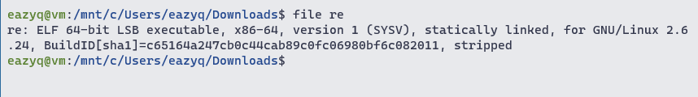
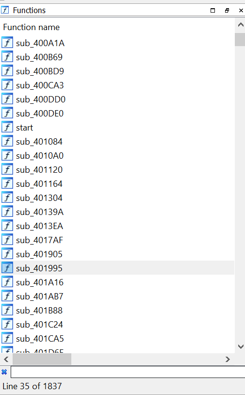
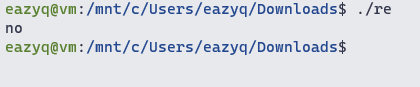
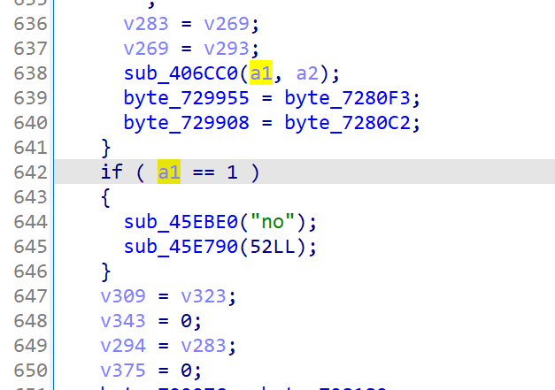
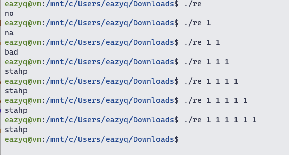
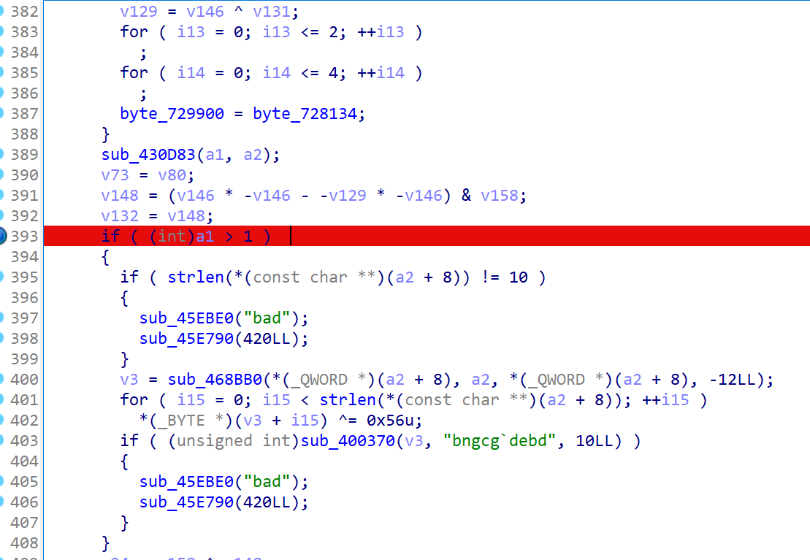
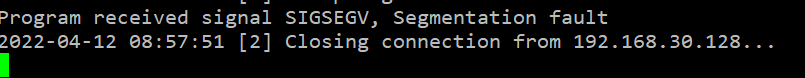
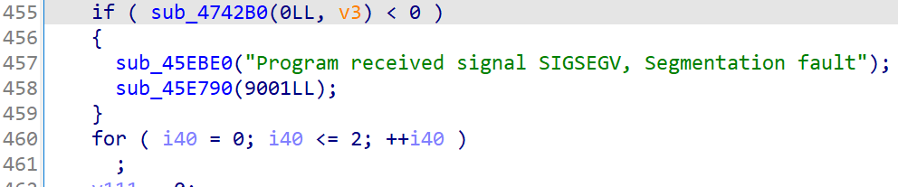
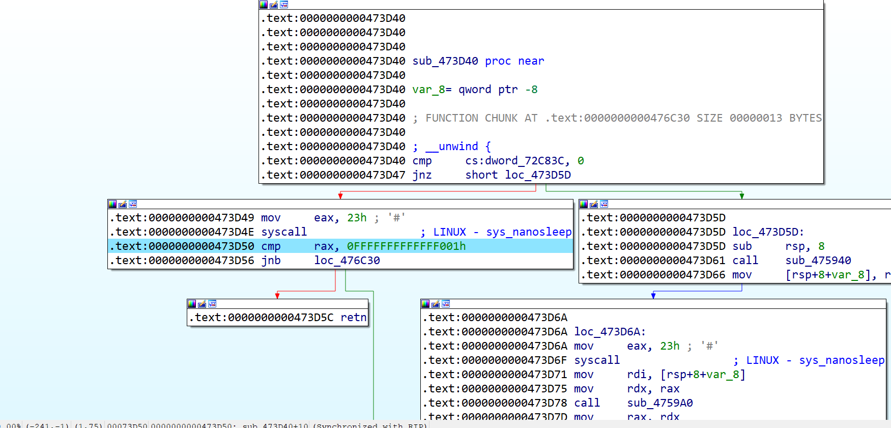
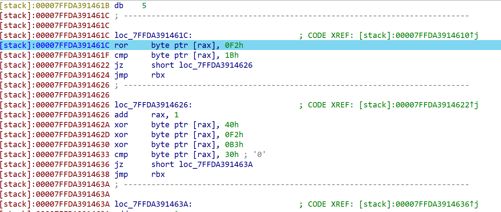

# Challenge 6

This binary has more than 1800 functions

Try to run it show this show this

Search for string `no` lead us to this

Here `a1` must be number of args passed to the program, `sub_45EBE0` print the string and `sub_45E790` exit the program

Try to pass more input to the program and we got this

Find these string in ida, we can see that the program only compare if number of args is equal 1, 2 or > 3

So maybe the number of args we need is 3, means that we have to pass 2 strings to the program

Here the second args is xored with `0x56` then being compared to ``bngcg`debd`` 

So the second args is `4815162342`

It's better to dynamic analyze from now on

Set up remote linux debugger and run the program with 2 parameters `4815162342` and `1`

So sth crash the program before it reach `bad`, maybe some anti debug technique?

Search for that string again, we get to these line

Inspect `sub_4742B0`, there is a `sys_ptrace` function. This is the anti-debug trick the program uses. 

We just have to nop that call

Run the program again, it's froze for a long time. Try to pause it will show us the reason

The call to `sys_nanosleep` make the program froze

Search for xref of these func, nop this func which contains all that sleep shit and we are good to go

By keep tracing and set bp to where the program crash, we can finally get to these interesting intruction

Where the program check char by char the third args which will be the flag we need

`l1nhax.hurt.u5.a1l@flare-on.com`

