# Challenge 7 

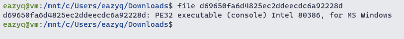

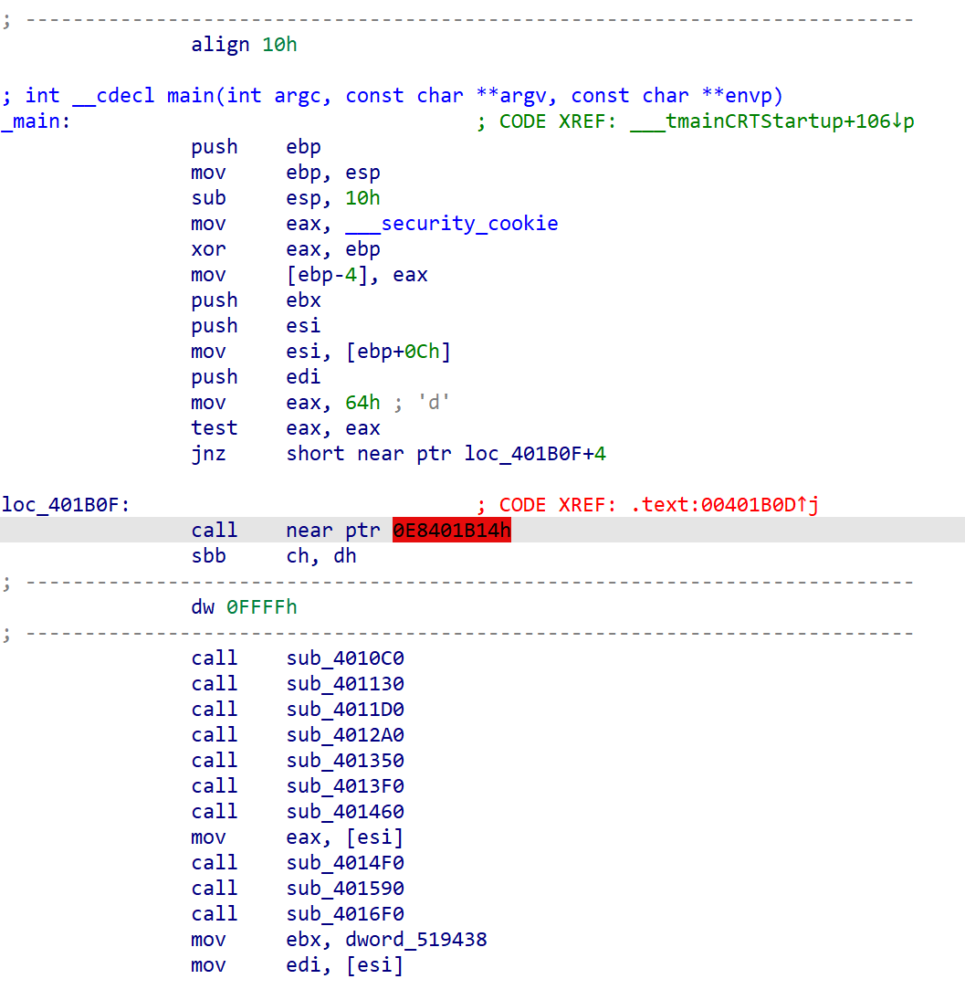

IDA failed to analyze this part in main function

We have to undefine them and then define again at offset `0x00401B13`

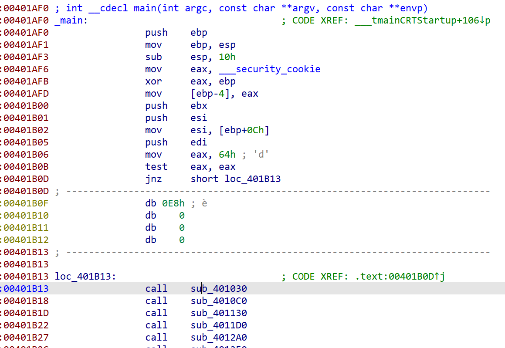

Now it looks better

Start analyzing `sub_401030` function, we can see that there is `IsDebuggerPresent` function

The program xor some data with a value that depend on the result of that function

If there is a debugger, data is xor-ed with `oh happy dayz`, else it is `the final countdown`

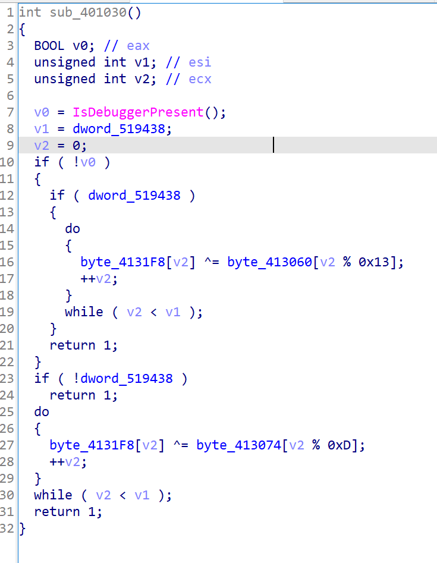

After that, the function return

Head to the next function `sub_4010C0`, this time another anti-debug technique is used

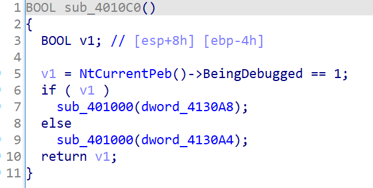

Again two different values: `UNACCEPTABLE` and `omglob`

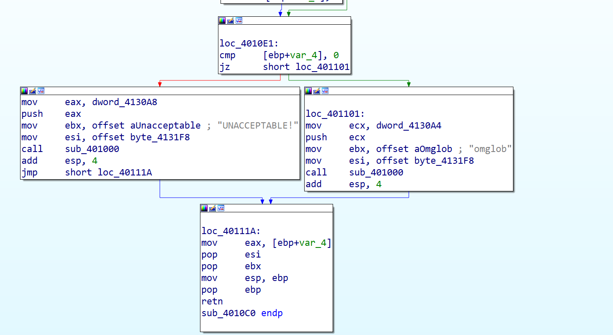

Function `sub_401130` use a technique called `Red Pill` that use instruction `sidt` to get the value of the `IDTR` register. By which can detect the machine that the program run on.

From `https://www.ozgurcatak.org/files/06-anti-dynamic-analysis.pdf`
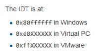

In our function, we can see it check if our machine is run on vmware

2 xor value: `you're so good` and `you're so bad`

Function `sub_4011D0` again use anti VM technique like the one above

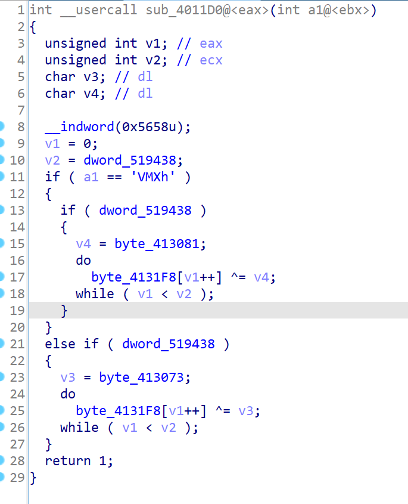

It querying the I/O communication port `VX`. This function detect vmware machine.

2 xor value: `\x66` and `\x01`

Function `sub_4012A0` use `SetLastError`, `OutputDebugStringW` and `GetLastError` to detect debugger. If there is a debugger, `GetLastError`'s return value is the same as `SetLastError`'s param.

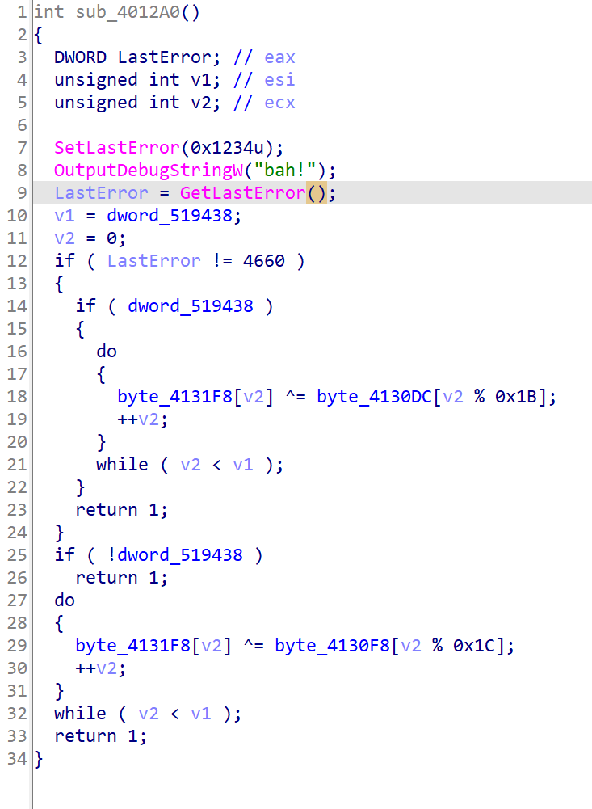

2 xor value: `I'm gonna sandbox your face` and `Sandboxes are fun to play in`

Function `sub_401350` just count the number of `0xcc` bytes between `sub_401030` and `sub_401780`

It's trying to detect breakpoint placed by debugger

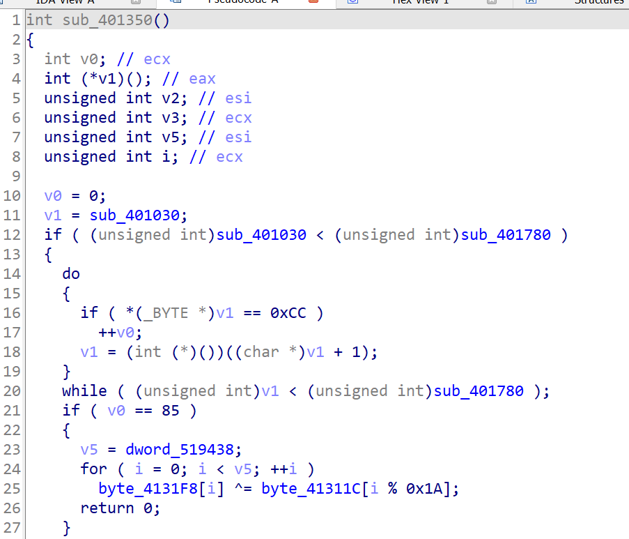

2 xor value: `Such fire. Much burn. Wow.`and `I can haz decode?`


Function `sub_4013F0` uses a simple anti-debug technique

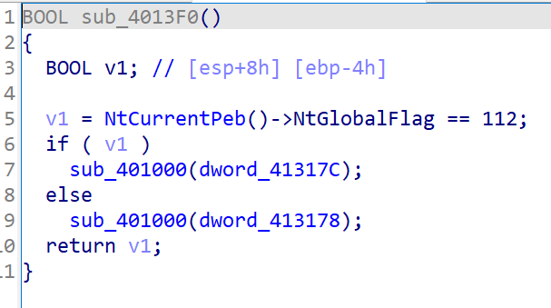

2 xor value: `Feel the sting of the Monarch!` and `\x09\x00\x00\x01`

Function `sub_401460` check if it is `Friday`, not sure which value is the right value for this function

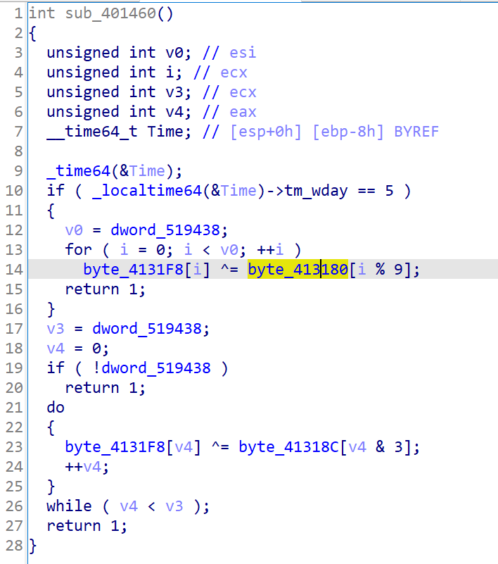

2 xor value: `! 50 1337` and `1337`

Function `sub_4014F0` check if the binary name is `backdoge.exe`

2 xor value: `MATH IS HARD` and `LETS GO SHOPPING`

Function `sub_401590` check if the machine can connect to the internet.

2 xor value: `SHOPPING IS HARD` and `LETS GO MATH`

Function `sub_4016F0` check if the time is between 5pm - 6pm

2 xor value: `\x01\x02\x03\x05\x00\x78\x30\x38\x0D` and `\x07\x77`

After these long ass anti-debug and anti vm function, the program xor the data with `backdoge.exe`

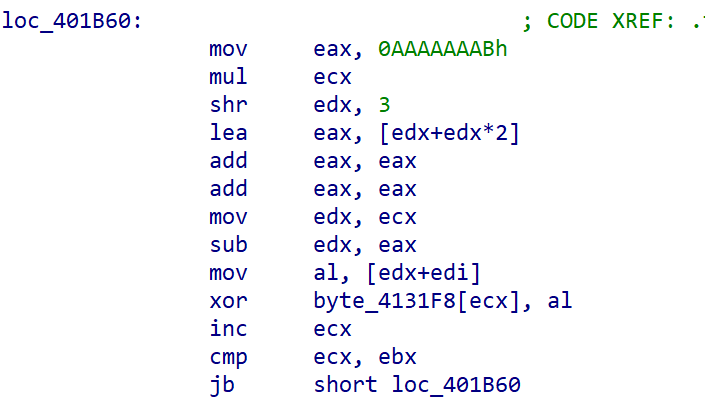

The last 2 function xor data with `192.203.230.10` and `jackRAT`,read 2 args from cmdline and place them to `byte_4131F9` and `byte_413278`, write those data to a `gratz.exe` then quit

According to a PE file header, these 2 args must be `MZ` and `PE`

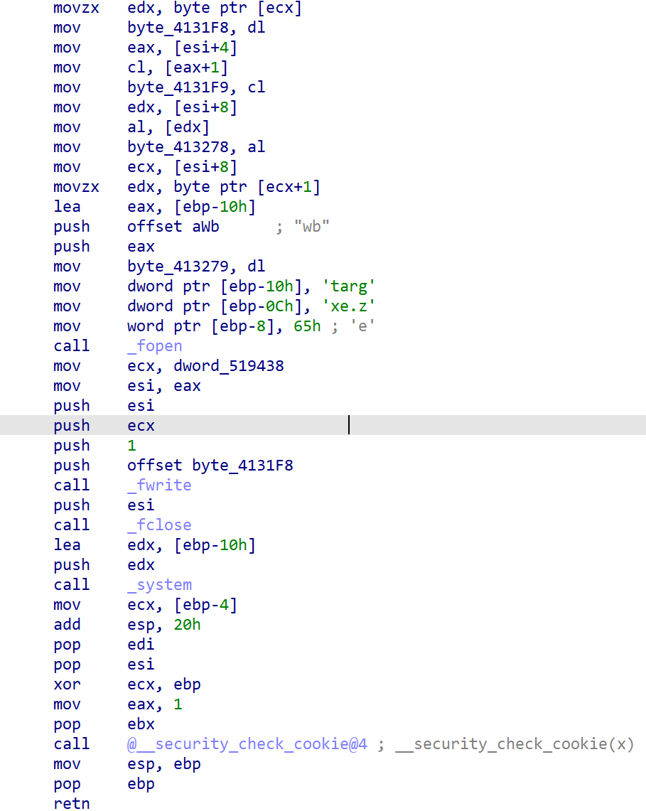

Now we have to decide which of those xor values is right for each function. If we assume that: `no vm, no debugger, has internet access` is the right route then we still have that `Friday` and `5pm`left

It is better to write a script to brute-force all possible way than guessing.

First we have to dump the data from the program. Load the file to x32dbg, change the value of `EIP` to the address which is after all the fuction then let the program run.

When we have the `gratz.exe` file, to brute the right sequence we only have to check for these bytes in pe header:

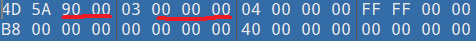

Script to brute-force

```python
key0 = ["oh happy dayz", "the final countdown"]
key1 = ["UNACCEPTABLE", "omglob"]
key2 = ["you're so good", "you're so bad"]
key3 = ["\x66", "\x01"]
key4 = ["I'm gonna sandbox your face", "Sandboxes are fun to play in"]
key5 = ["Such fire. Much burn. Wow.", "I can haz decode?"]
key6 = ["Feel the sting of the Monarch!", "\x09\x00\x00\x01"]
key7 = ["! 50 1337", "1337"]
key8 = ["MATH IS HARD", "LETS GO SHOPPING"]
key9 = ["SHOPPING IS HARD", "LETS GO MATH"]
key10 = ["\x01\x02\x03\x05\x00\x78\x30\x38\x0D", "\x07\x77"]
key11 = ["backdoge.exe"]
key12 = ["192.203.230.10"]
key13 = ["jackRAT"]

result = []
check  = [0x4D,0x5A,0x90,0x47,0x04,0x56,0x5E,0x49,0x24,0x19,0x5B,0x6C,0xD7,0xC1,0x67,0x69]

def xor(a, b):
    len_a = len(a)
    len_b = len(b)
    if (len_a >= len_b):
        a = a[:len_b]
    else:
        c = len_b // len_a
        d = len_b % len_a
        a = a * c + a[:d]

    result = []
    for i in range(0, len_b):
        result.append(ord(a[i]) ^ b[i])
    return result


for i0 in key0:
    for i1 in key1:
        for i2 in key2:
            for i3 in key3:
                for i4 in key4:
                    for i5 in key5:
                        for i6 in key6:
                            for i7 in key7:
                                for i8 in key8:
                                    for i9 in key9:
                                        for i10 in key10:
                                            for i11 in key11:
                                                for i12 in key12:
                                                    for i13 in key13:
                                                        check = xor(i0, check)
                                                        check = xor(i1, check)
                                                        check = xor(i2, check)
                                                        check = xor(i3, check)
                                                        check = xor(i4, check)
                                                        check = xor(i5, check)
                                                        check = xor(i6, check)
                                                        check = xor(i7, check)
                                                        check = xor(i8, check)
                                                        check = xor(i9, check)
                                                        check = xor(i10, check)
                                                        check = xor(i11, check)
                                                        check = xor(i12, check)
                                                        check = xor(i13, check)
                                                        if (check[2] == 0x90 and check[3] == 0x00 and check[5] == 0x00 and check[6] == 0x00 and check[7] == 0x00):
                                                            final = []
                                                            final.append(i0)
                                                            final.append(i1)
                                                            final.append(i2)
                                                            final.append(i3)
                                                            final.append(i4)
                                                            final.append(i5)
                                                            final.append(i6)
                                                            final.append(i7)
                                                            final.append(i8)
                                                            final.append(i9)
                                                            final.append(i11)
                                                            final.append(i12)
                                                            final.append(i13)
                                                            print(final)
```


We got 2 results

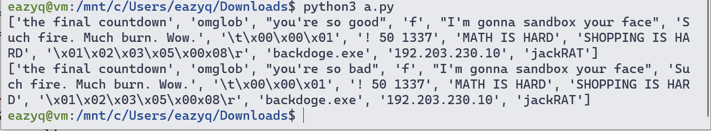

They are all the same except for the third one. We can see the pattern that this program's true path is the machine must not run on vmware and there is no debugger so `you're so bad` is the one that we need.

```python
a = ['the final countdown', 'omglob', "you're so bad", 'f', "I'm gonna sandbox your face", 'Such fire. Much burn. Wow.', '\t\x00\x00\x01', '! 50 1337', 'MATH IS HARD', 'SHOPPING IS HARD', '\x01\x02\x03\x05\x00x08\r', 'backdoge.exe', '192.203.230.10', 'jackRAT']

def xor(a, b):
    len_a = len(a)
    len_b = len(b)
    if (len_a >= len_b):
        a = a[:len_b]
    else:
        c = len_b // len_a
        d = len_b % len_a
        a = a * c + a[:d]

    result = []
    for i in range(0, len_b):
        result.append(ord(a[i]) ^ b[i])
    return result

with open("gratz.exe", "rb") as f:
    b = f.read()
    for i in a:
        b = xor(i, b)
    
    with open("out.exe", "wb") as ff:
        ff.write(bytearray(b))
```

After that we have to change bytes at offset `0x00` to `MZ` and `0x80` to `PE`. Then the program is runable.


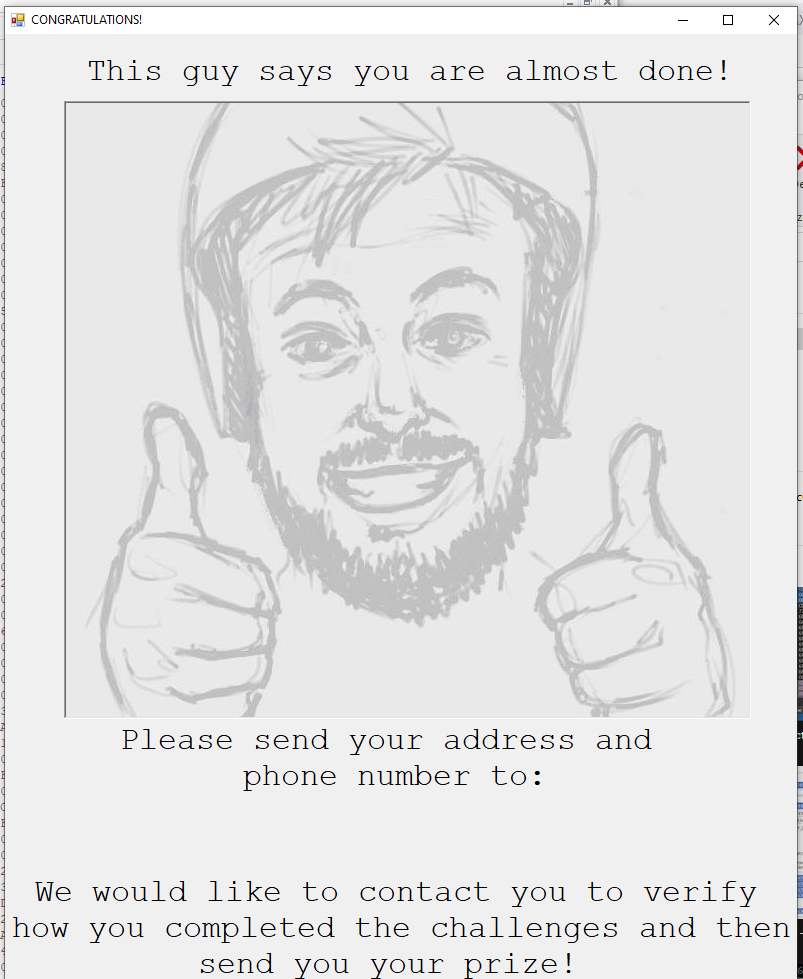


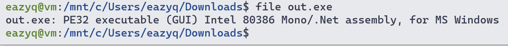


Load the file to dnspy

Nothing much except for this

Try to decode that with this script

```python
def decoder2(encoded):
    text = ""
    text2 = "this"
    for i in range(0, len(encoded)):
        text += chr((ord(encoded[i]) ^ ord(text2[i % len(text2)])))

    return text


def decoder4(encoded):
    text = ""
    text2 = decoder2("\u001b\u0005\u000eS\u001d\u001bI\a\u001c\u0001\u001aS\0\0\fS\u0006\r\b\u001fT\a\a\u0016K")
    for i in range(0, len(encoded)):
        text += chr((ord(encoded[i]) ^ ord(text2[i % len(text2)])))
    
    return text


flag = "\v\fP\u000e\u000fBA\u0006\rG\u0015I\u001a\u0001\u0016H\\\t\b\u0002\u0013/\b\t^\u001d\bJO\a]C\u001b\u0005"

print(decoder4(flag))
```


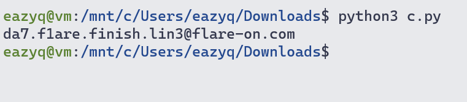

`da7.f1are.finish.lin3@flare-on.com`


